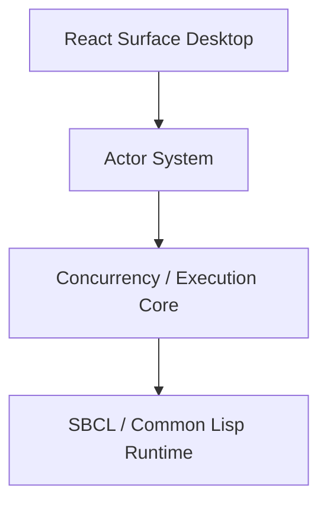
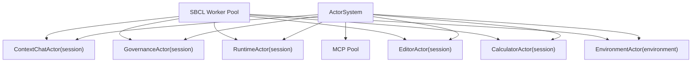
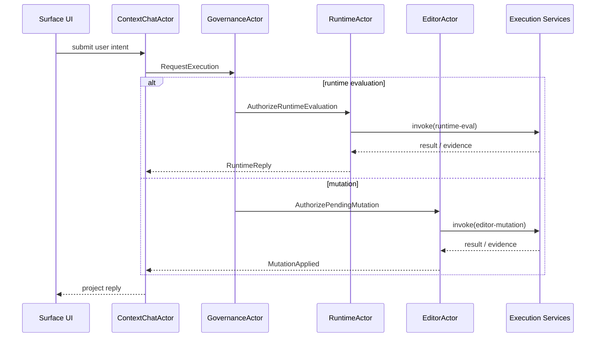
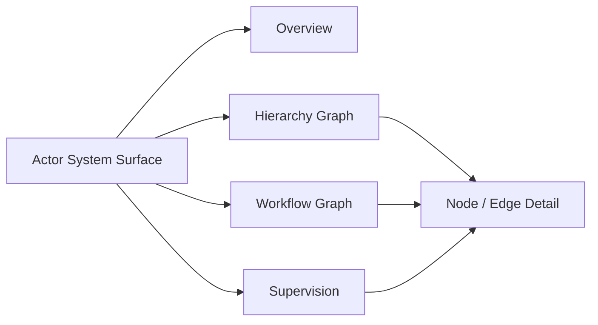
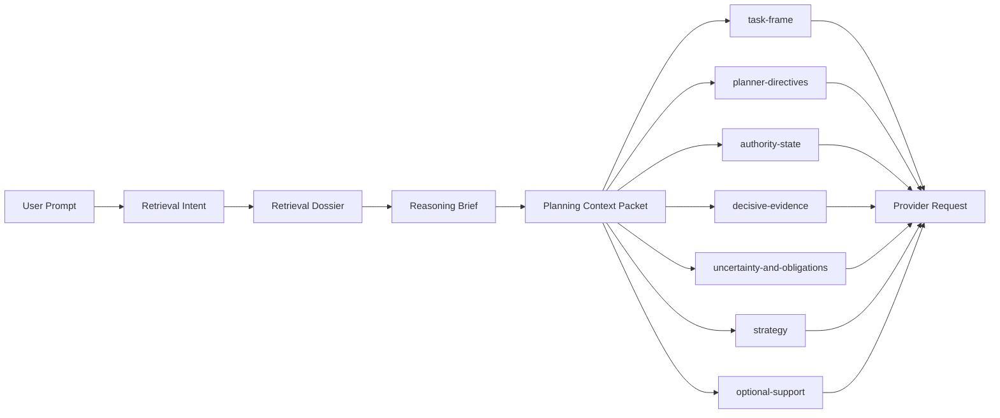
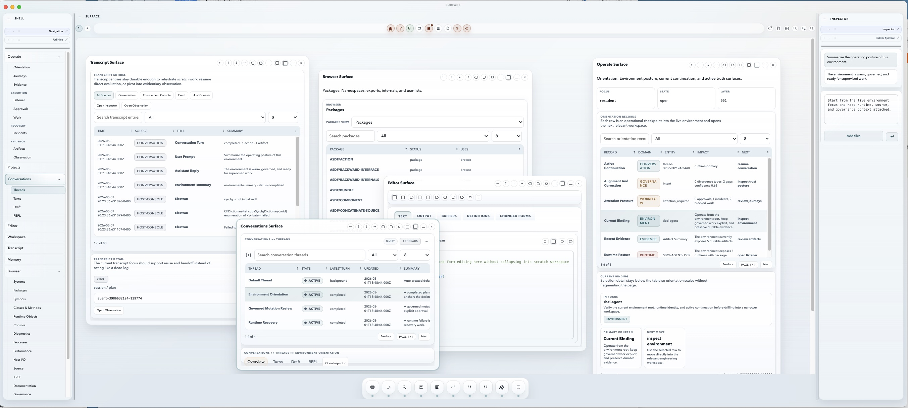

# sbcl-agent

`sbcl-agent` is an SBCL-native, image-native, governed execution environment.

It began as a Codex-style shell, but the project has matured into something more specific: an environment-centered actor runtime in which source truth, live runtime truth, and workflow truth are all first-class and explicitly related.

The point of the project is not to recreate a conventional IDE in Lisp or to wrap an LLM with shell tools. The point is to let humans and agents inspect and mutate the same running system they are reasoning about while preserving approvals, evidence, incidents, reconciliation, and operator trust.

The current architecture is layered:

1. `SBCL / Common Lisp` as runtime, persistence, and introspection substrate
2. a shared `Concurrency / Execution Core` as the bounded worker, queue, and execution-registry substrate
3. an address-based `Actor System` as the primary capability, workflow, and governance layer
4. a React `Surface` desktop as the presentation tier

The integrated agent runs in the same environment it is operating on. Context is not gathered from a separate external model of the system. It is gathered from the live environment itself, and native policy-based governance is part of the execution substrate rather than an afterthought.

## Licensing

This repository is licensed under the [Apache License 2.0](LICENSES/APACHE-2.0.txt).

## Why It Exists

The dominant SDLC model was correct for the constraints it was built under:

- runtime state was hard to inspect directly
- live mutation was risky
- feedback loops were delayed

Those constraints produced a source-first engineering model that emphasized isolation, stability, and reproducibility.

That model still matters, but it increasingly limits direct understanding of stateful systems. Most toolchains and agent systems still operate on files, logs, and tool outputs as proxies for the system rather than on the runtime itself.

`sbcl-agent` explores a different model:

- source truth: files, diffs, tests, and durable artifacts
- image truth: the live SBCL image, loaded definitions, packages, objects, threads, and runtime resources
- workflow truth: the governed record of plans, mutations, approvals, validations, checkpoints, and reconciliation

## What Makes It Different

- The shell is actually Common Lisp. Unrecognized forms are evaluated directly in the host runtime.
- The live SBCL image is part of the engineering substrate, not disposable infrastructure.
- Conversation is durable through threads, turns, operations, and artifacts, but conversation does not replace the runtime or workflow model.
- Governance is intrinsic. Policy, approvals, incidents, work-items, workflow records, validation, and reconciliation are part of the architecture.

## Current State

The codebase is real and usable today. It currently provides:

- an SBCL-native CLI and interactive Common Lisp shell
- direct Lisp evaluation in the same runtime that hosts the agent
- multi-vendor provider support across mock, OpenAI-compatible, Anthropic, Google/Gemini-compatible, Meta-compatible, and LM Studio/local OpenAI-compatible endpoints
- provider profiles, provider routing, provider-route preview, and provider-aware model selection
- canonical provider-event normalization and streaming
- a concrete `Environment` object with save/load, summaries, and projected environment events
- durable `thread`, `message`, `turn`, `operation`, and `artifact` records
- a shared turn runner for both `ask` and `say`
- approval-aware turn orchestration and resumed-turn follow-up
- pre-prompt environment retrieval, cognition bundles, validation planning, and prior-outcome reuse in the default agent loop
- a public service boundary plus JSON CLI surfaces that shell, desktop, and external clients can call without scraping shell output
- structured tools for files, docs, runtime, processes, git, and patches
- persisted state for tasks, workers, work-items, workflow records, incidents, and reconciliation evidence
- public `invoke`, `inspect`, and `control` service seams with execution handles becoming the primary operator reference
- an explicit actor registry plus execution capability registry for authoritative ingress and discoverable operator surfaces
- explicit execution surfaces, shell workspace, governance queue, object browser, and inspector models
- compatibility execution tracking for hosted process-style capabilities
- a canonical planning-context packet with task framing, authority state, decisive evidence, uncertainty handling, strategy posture, and optional support
- durable `agent-constitution` and planner-grade `capability-inventory` context in the environment and provider request path
- contradiction-aware reasoning and uncertainty arbitration for missing authority, stale context, capability drift, and project ambiguity
- explicit Context Chat project targeting with zero, one, or many selected projects carried through environment context and planner authority
- a hostable desktop contract consumed by `sbcl-agent-ux`
- developer-platform manifests and `.aop` package export, validation, import, activation, install, and applied-profile queries

The project is also intentionally transitional. It has completed the major cutover away from a monolithic kernel model toward a shared execution substrate plus actor-owned governance, but some compatibility and terminology cleanup still exists in the implementation and docs.

## Documentation

Start here:

1. [Documentation Home](docs/index.md)
2. [The Problem](docs/problem.md)
3. [Application Domains](docs/application-domains.md)
4. [Foundation](docs/foundation.md)
5. [Architecture](docs/architecture.md)
6. [Getting Started](docs/getting-started.md)
7. [User Guide](docs/user-guide.md)
8. [Safety and Risk](docs/safety-and-risk.md)
9. [Context Engineering](docs/context-engineering.md)

Then use these as secondary or forward-looking material:

- [Why sbcl-agent Exists](docs/why-sbcl-agent.md)
- [Objectives](docs/objectives.md)
- [Implementation Plan](docs/implementation-plan.md)
- [Vision](docs/roadmap/vision.md)
- [Environment Model](docs/roadmap/visionp2.md)
- [Conversation Runtime](docs/conversation-architecture.md)
- [Streaming Event Model](docs/streaming-event-model.md)
- [Thread Runtime Migration Plan](docs/migration-plan-thread-runtime.md)

If you are new to Common Lisp, start with [Common Lisp as a Runtime](docs/common-lisp-runtime.md) and then [Common Lisp Reference](docs/common-lisp-guide.md).

## Architecture At A Glance

The current architecture is best understood as a four-layer stack:



The actor system now sits between the presentation tier and the shared execution substrate:



Conversation-driven execution now follows an actor-routed governed path rather than a direct chat-to-runtime shortcut:



The live Actor System surface exposes hierarchy, workflow, runtime pressure, and supervision directly from actor-system state:



The planning/runtime context path is now equally important. Provider-bound requests are built from one canonical packet rather than a loose collection of summaries:



## Current Surface Desktop

The current `Surface` desktop host over `sbcl-agent` is shown below. It is the clearest concrete picture of how the environment, browser, conversations, execution surfaces, evidence, and inspector can coexist in one operator workspace.



## What It Does Today

The current runtime already provides:

- an SBCL-native CLI and interactive Common Lisp shell
- direct Lisp evaluation in the same environment that hosts the agent
- a provider boundary with mock, OpenAI-compatible, Anthropic, Google/Gemini-compatible, Meta-compatible, and LM Studio/local-compatible backends
- provider profiles, routing policies, ranked candidate selection, and prompt-aware route preview
- streamed responses through a canonical provider-event layer
- conversation primitives: threads, messages, turns, operations, and artifacts
- a shared turn runtime for both `ask` and `say`, with conversation treated as one native interaction medium rather than the whole system
- persisted session state with thread-aware shell workflows
- staged assistant actions, approval-gated turn resume, provider follow-up after resume, and explicit capability grants
- environment-native retrieval dossiers, reasoning/planning briefs, durable prior-outcome reuse, and validation/execution strategy shaping
- structured tools for files, docs, session visibility, processes, git, and patches
- queued tasks and background workers
- governed work-items, workflow records, validator replay groups, image-only outcomes, and reconciliation records
- policy-governed mutation turns for patches, mutating runtime eval, and write-class tools such as git-write

## Design Rule

The current architecture is still organized around one rule:

- conversation owns interaction state
- runtime owns execution state
- workflow owns engineering governance

That rule still matters, but it now sits inside a larger framing: the shell, REPL, threads, artifacts, work-items, and agents are all becoming inhabitants of a larger `Environment` object rather than independent top-level concepts.

At the same time, the current architecture has consolidated mutation and inspection around shared execution services:

- `invoke` is becoming the mandatory execution entry path
- `inspect` is becoming the primary read path over execution-backed objects
- `control` is becoming the governed intervention path for approvals, recovery, compatibility lifecycle, and shell-hosted desktop actions

## Requirements

- SBCL
- a POSIX-like shell environment for the helper scripts in `bin/`
- git if you want git-backed tooling and workflows

The project is developed and tested against SBCL. Other Common Lisp implementations are not current targets.

## Repository Layout

The runtime is still serially loaded through `sbcl-agent.asd`, but responsibility is clearer than a flat file listing suggests:

- environment runtime: environment domain files, workflow/work-items, incidents, runtime state
- provider boundary: protocol, transport, request snapshot, provider adapters
- service boundary: `*-service.lisp` files plus `service-core.lisp`
- operator shell: command normalization, shell dispatch, REPL, CLI
- tests: smoke coverage plus focused provider/service/support suites

Representative files:

- environment runtime: `src/environment-core.lisp`, `src/environment-sync.lisp`, `src/environment-summary.lisp`, `src/environment-compatibility.lisp`, `src/mutation-engine.lisp`, `src/work-items.lisp`, `src/workflow.lisp`
- execution core and services: `src/execution-registry-core.lisp`, `src/concurrency-core.lisp`, `src/execution-handle-service.lisp`, `src/shell-service.lisp`
- provider boundary: `src/request-snapshot.lisp`, `src/provider-protocol.lisp`, `src/provider-transport.lisp`, `src/provider-transport-curl.lisp`, `src/provider-openai.lisp`
- service boundary: `src/environment-service.lisp`, `src/conversation-service.lisp`, `src/runtime-service.lisp`, `src/execution-service.lisp`, `src/session-service.lisp`, `src/rgp-service.lisp`, `src/mutation-review-service.lisp`, `src/task-service.lisp`, `src/worker-service.lisp`, `src/workflow-ops-service.lisp`, `src/platform-service.lisp`
- operator shell and entrypoints: `src/shell.lisp`, `src/repl.lisp`, `src/main.lisp`, `bin/sbcl-agent`
- tests: `tests/smoke.lisp`, `tests/provider-context.lisp`, `tests/service-contracts.lisp`, `tests/test-runner.lisp`

## Quick Start

From the repository root:

```bash
./bin/sbcl-agent doctor
./bin/sbcl-agent chat
./bin/sbcl-agent chat -i
./bin/run-tests
./bin/run-evals
```

To start the conversational layer that sits on top of the REPL layer:

1. Start the Lisp shell with `./bin/sbcl-agent chat`.
2. Inside that shell, create or select a thread with `(thread/new :title "my thread")` or `(thread/use "thread-id")`.
3. Start a conversational turn with `(say "your prompt here")`.

There is no separate conversation-only process. The conversation layer runs inside the same `chat` shell.

Top-level CLI commands:

- `./bin/sbcl-agent help`
- `./bin/sbcl-agent doctor`
- `./bin/sbcl-agent chat`
- `./bin/sbcl-agent chat -i`
- `./bin/sbcl-agent provider <subcommand> ...`
- `./bin/sbcl-agent exec <cmd...>`
- `./bin/sbcl-agent rgp <subcommand> ...`
- `./bin/run-tests`
- `./bin/run-evals`
- `./bin/run-concurrency-regression`
- `./bin/run-concurrency-performance`
- `./bin/run-actor-system-regression`
- `./bin/run-actor-system-performance`
- `./bin/run-coverage`
- `./bin/install-docs-deps`
- `./bin/build-docs`
- `./bin/serve-docs`

`chat -i` enables interactive streaming by default for `(ask ...)` calls while preserving the normal Lisp shell behavior.

## Shell Model

Inside `chat`, recognized forms are treated as shell commands. Everything else is evaluated as normal Lisp in the `SBCL-AGENT-USER` package.

Core interaction paths:

- direct Lisp evaluation for local reasoning and runtime inspection
- `(ask ...)` for compatibility with the original streamed ask workflow, now backed by the same turn runner as `say`
- `(say ...)` for thread-based conversational turns
- thread commands for creating, listing, switching, and inspecting conversations
- turn commands for status inspection, approval-gated resume, and follow-up-aware completion
- tools, tasks, workers, work-items, replay, and reconciliation commands

Example session:

```lisp
(+ 100 203)
(thread/new :title "provider refactor")
(say "Summarize the current provider and event architecture." :stream t)
(turn/status)
(describe-session)
```

## RGP Integration

`sbcl-agent` now includes a governed runtime bridge for RGP. The bridge binds an Environment to an external governance session without collapsing `sbcl-agent` into a plain prompt/response provider.

The CLI surface is:

- `./bin/sbcl-agent rgp bind`
- `./bin/sbcl-agent rgp show`
- `./bin/sbcl-agent rgp export`
- `./bin/sbcl-agent rgp artifacts`
- `./bin/sbcl-agent rgp approvals`
- `./bin/sbcl-agent rgp approve`
- `./bin/sbcl-agent rgp resume`

Those commands let RGP:

- bind a governed request and agent-session to a durable `sbcl-agent` environment
- inspect environment, thread, turn, operation, and artifact summaries
- list governed approval checkpoints and importable artifacts
- approve or resume pending governed work-items in the external runtime

The shell exposes the same bridge through `integration/rgp-*` commands, so local operators and external governance systems can inspect the same governed runtime state.

## Runtime Configuration

Environment variables:

- `TUTOR_CODEX_PROVIDER`: provider backend override; when unset, the runtime chooses `openai-compatible` if an OpenAI-style key is available, `anthropic` if only an Anthropic key is available, and otherwise falls back to `mock`
- `TUTOR_CODEX_MODEL`: primary model name, defaults to `gpt-5`
- `TUTOR_CODEX_FAST_MODEL`: low-latency model name for ordinary asks, defaults to `gpt-4.1-mini`
- `TUTOR_CODEX_API_BASE`: base URL for OpenAI-compatible, local, or other compatible transports
- `OPENAI_API_KEY`: API key for the OpenAI-compatible provider family
- `ANTHROPIC_API_KEY`: API key for the Anthropic provider family

If `OPENAI_API_KEY` is unset, `sbcl-agent` falls back to `openai-api-key.key` in the current working directory and trims trailing whitespace. If `ANTHROPIC_API_KEY` is unset, it falls back to `anthropic-api-key.key` in the current working directory.

## Provider Control Surface

The provider layer is no longer just a startup configuration choice. It now has a first-class runtime control surface.

Inside `chat`, use:

- `(provider/show)`
- `(provider/list)`
- `(provider/use "profile")`
- `(provider/configure "profile" :provider "name" :model "name" ...)`
- `(provider/routing [:auto|:manual])`
- `(provider/route)`

Outside the shell, use the JSON CLI:

- `./bin/sbcl-agent provider show`
- `./bin/sbcl-agent provider route`
- `./bin/sbcl-agent provider preview --prompt "..."`
- `./bin/sbcl-agent provider routing --mode auto|manual`
- `./bin/sbcl-agent provider configure --profile ... --provider ... --model ...`
- `./bin/sbcl-agent provider use --profile ...`

Those commands expose the same service-backed provider profile, routing, and route-preview surfaces that a future `sbcl-agent-ux` client should call directly.

## Desktop And Platform Direction

`sbcl-agent-ux` is no longer supposed to reconstruct shell behavior from many unrelated service calls.

The current direction is:

- `sbcl-agent` owns the execution core, shell workspace, inspector, governance queue, and desktop host contract
- `sbcl-agent-ux` consumes that host contract through `desktop/show`, `desktop/action`, and `desktop/restore`
- the platform layer is beginning to expose installable `.aop` package descriptors and applied active-package profiles

That means the docs should now be read as describing a governed execution environment that already satisfies the accepted `IntentOS` target architecture, with current work focused on enhancement, hardening, and backend evolution rather than target-architecture gap closure.

## Doctor Command

`./bin/sbcl-agent doctor` reports the current runtime state, including:

- provider and model selection
- working directory and shell package
- session id and event counts
- pending assistant actions
- queued tasks and active workers
- approved policies and capability grants
- work-item, replay-group, and image-reconciliation counts
- operator status buckets
- sandbox profiles
- API base and API key presence

Use `doctor` first when startup or configuration looks wrong.

## Testing

The test suite is run through the project scripts:

```bash
./bin/run-tests
./bin/run-coverage
```

The mock provider is the fastest way to validate shell, event, and orchestration behavior without external network dependencies.

## Docs Publishing

The docs site is generated from the Markdown sources in `docs/` through Jekyll rather than maintained as checked-in rendered HTML.

Local workflows:

```bash
./bin/install-docs-deps
./bin/build-docs
./bin/serve-docs
```

The generated site is written to `docs/_site/` and is ignored by git. GitHub Pages deployment is defined in `.github/workflows/docs.yml`.
