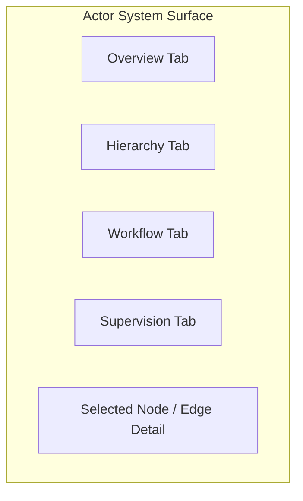
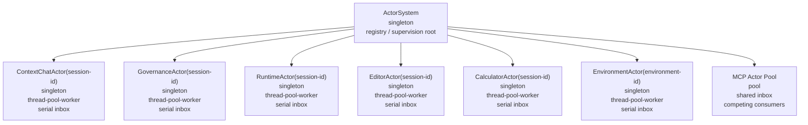
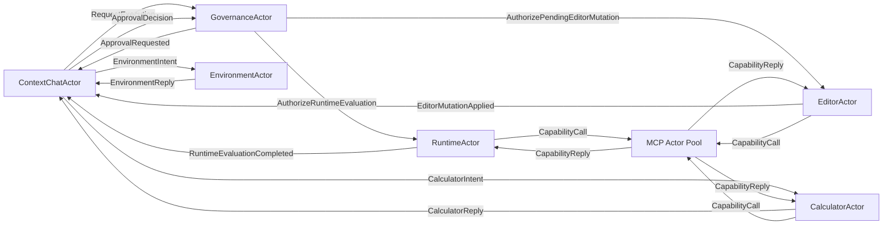

# Actor System Surface

This document defines the live operator surface for the actor runtime.

It should be read together with the concurrency and governance model. The actor system is not just a hierarchy viewer. It is the operator-facing projection of:

- actor ownership and workflow continuity
- bounded worker-pool execution
- queue and mailbox pressure
- supervision and recovery posture
- governed approval and validation waits

The current implementation now has a dedicated `Actor System Surface` inside `Surface`, and the documentation should reflect that real shape rather than the earlier minimum viable stub.

The surface needs to show two things clearly:

1. the actor hierarchy from the `ActorSystem` root
2. the workflow/message graph showing which actors send messages to which other actors

The surface must be rendered from live actor-registry, mailbox, worker-pool, and incident data. It must not reconstruct architecture from transcript history.

## Panel Layout

## Current Tab Model

The current surface should expose:

- `Overview`
  - root actor id
  - actor count
  - workflow edge count
  - open incident count
  - runtime worker count
  - busy / idle workers
  - queued jobs
  - approval-blocked or validation-blocked actor count when available
- `Hierarchy`
  - interactive node graph
  - zoom
  - background drag-to-pan
  - horizontal and vertical scrollbars on overflow
  - node hover detail
- `Workflow`
  - interactive sender/receiver graph
  - message volumes and operation labels
  - edge detail inspection
- `Supervision`
  - open and recent incidents
  - parent lineage
  - action taken or pending
  - recovery recommendation
  - replay or recovery class when durable continuation is available

## Hierarchy View

This is the current hierarchy expected from the actor-system root.

### Hierarchy Rendering Rules

1. Each node shows:
   - actor display name
   - actor address id
   - allocation strategy: `singleton` or `pool`
   - execution model
   - mailbox mode

2. If the actor is pooled, the node also shows:
   - shared inbox id
   - pool size
   - pool consumption policy

3. If the actor has an active failure state, the node should visually indicate:
   - degraded
   - quarantined
   - dead-lettered
4. Hierarchy is the primary operational view, so node hover should also surface mailbox pressure and runtime execution detail for that actor.

## Workflow / Message Graph

This view shows actor-to-actor message flow, not ownership hierarchy.

### Workflow Rendering Rules

1. Directed edges represent actor messages by address.
2. Edge labels represent message type or workflow step.
3. Edge thickness or color should represent activity:
   - arrival volume
   - departure volume
   - error volume
4. The graph should support filtering by:
   - session id
   - actor id
   - actor message id
   - approval id
   - pending action id

## Selected Actor Details

Selecting any actor should show:

- actor address id
- parent actor id
- allocation strategy
- execution policy
- supervision policy
- capability list
- configured LLM profile
- inbox id
- outbox id
- recent workflow ownership or linked governed work where applicable
- recent recovery or supervision posture when the actor owns resumable continuation

## Metrics

Each actor detail view should expose, at minimum:

- inbox depth
- outbox depth
- recent arrival count
- recent departure count
- arrival rate
- departure rate
- open supervision incident count
- recent failure count
- queued mailbox count
- failed mailbox count

For the runtime actor and pooled actors, also show:

- pool size
- shared inbox id
- consumer policy
- active consumer count
- busy workers
- idle workers
- queue depth
- submitted jobs
- completed jobs
- failed jobs

## Backend Data Contract

The live surface should be backed by one aggregate actor-system query that returns:

- actor registry definitions
- actor hierarchy edges
- workflow/message edges
- mailbox counts and throughput metrics
- actor supervision incidents
- pool configuration
- runtime execution summary
- workflow ownership and native workflow-edge summaries for actor-owned continuation
- durable recovery and replay annotations where the actor/runtime slice exposes them

The `Actor System Surface` should project directly from actor-system state.

In the current architecture, that state is not just runtime pressure telemetry. It is also part of the governed execution model. The surface should therefore be able to explain:

- which actors currently own live work
- which actors are blocked on approval or validation
- which actors have recoverable continuation checkpoints
- which incidents can be resumed, replayed, or require manual intervention
