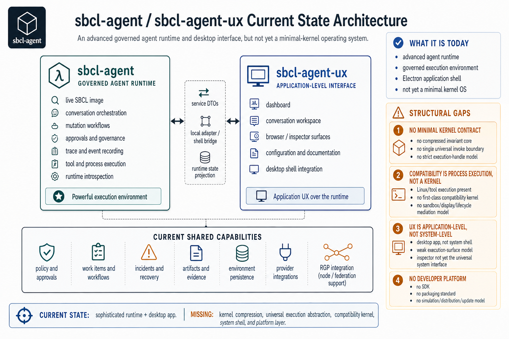

# sbcl-agent / sbcl-agent-ux – Historical Baseline Architecture Assessment

## Historical Baseline Diagram



## Executive Summary

This page is now historical context, not the authoritative description of the current implementation.

Use [IntentOS Target Architecture]({{ '/agentos-target-state-architecture.html' | relative_url }}) as the primary current-state architecture reference. This page remains useful because it shows the older baseline that the implementation program was refactoring away from.

The current system consists of:

```text
sbcl-agent
  → governed agent runtime
  → SBCL image-based execution
  → mutation, approval, and trace mechanisms

sbcl-agent-ux
  → Electron-based UX
  → application-level interface
```

That baseline has since been materially superseded. The repository now represents an implemented execution-kernel environment and hosted UX rather than an advanced runtime that is still missing its architectural center.

The earlier target-state gap program is now closed at the accepted architecture level. The right remaining questions are:
- how realistic the runtime backends are
- how deep the forensic and artifact model is
- how strong the QA and evidence discipline is
- how ergonomic the operator surfaces are

## Architecture Assessment 1: Minimal Kernel Contract

Current system exposes multiple top-level primitives:

- intention
- agent
- capability
- authority
- execution
- mutation
- trace
- policy
- approval

These are now compressed under a real execution-kernel contract.

Current state:
- single execution abstraction: present through execution handles
- single invocation path: present for the governed operator surface through `invoke`
- lifecycle model: present
- non-bypassable kernel boundary: present at the accepted target level

Remaining work:
- deeper backend realism
- broader forensic and artifact detail

## Architecture Assessment 2: Compatibility Kernel

Current Linux and tool execution is now a real compatibility subsystem:

- Linux application manifests
- backend abstraction
- filesystem/network/display posture
- lifecycle governance
- relaunch and control
- shell and desktop visibility

Remaining work:

- more backend diversity beyond the currently implemented governed backends
- richer isolation models where needed

## Architecture Assessment 3: UX Kernel

Current UX now consists of:

```text
IntentOS-style shell desktop contract
  + sbcl-agent-ux as a host over that contract
```

Current state:
- workspace model: present
- execution surfaces: present
- inspector: present
- governance visibility: present
- object browser: present
- display lane: present

Remaining work:
- more polish and presentation refinement
- broader component and journey coverage in the UX repo

## Architecture Assessment 4: Developer Platform

The system now has a real platform model:

- manifest and package format
- import / install / activate lifecycle
- applied platform profiles
- audit and history
- compatibility app extension through packages
- test and harness surfaces

Remaining work:
- deeper external SDK/distribution breadth
- broader ecosystem tooling

## Final Assessment Statement

The system no longer lacks compression, invariants, or a formal operating-system-style execution boundary at the accepted target level.

The remaining work is enhancement and hardening, not unresolved target-architecture closure.
