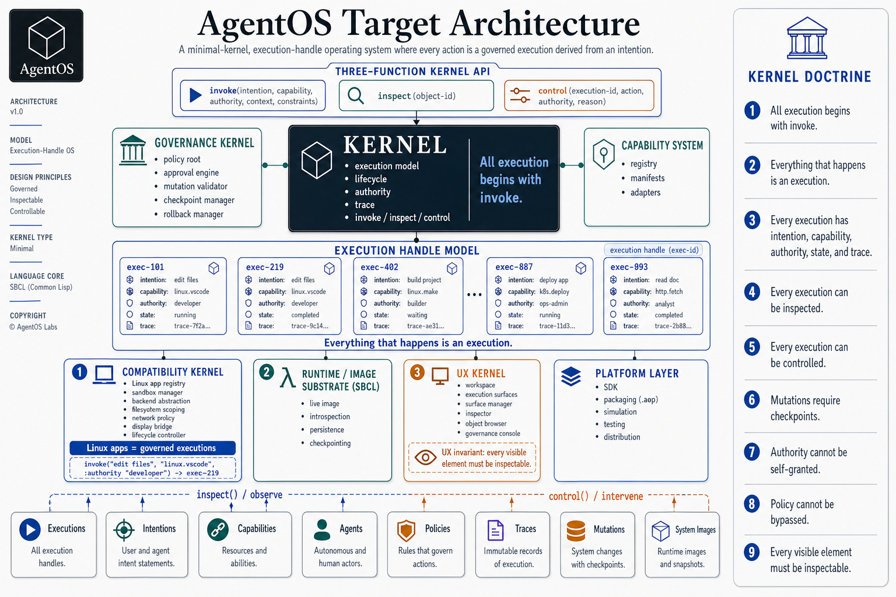

# AgentOS – Target-State Architecture

## Core Definition

AgentOS is a minimal-kernel, execution-handle operating system where every action is a governed execution derived from an intention.

## Architecture Context Diagram



## Kernel Doctrine

1. All execution begins with `invoke`.
2. Everything that happens is an execution.
3. Every execution has:
   - intention
   - capability
   - authority
   - state
   - trace
4. Every execution can be inspected.
5. Every execution can be controlled.
6. Mutations require checkpoints.
7. Authority cannot be self-granted.
8. Policy cannot be bypassed.
9. Every visible element must be inspectable.

## Kernel API

```lisp
(invoke intention capability &key authority context constraints)
(inspect object-id)
(control execution-id action &key authority reason)
```

## Core Abstraction

Execution handle (`exec-id`)

Equivalent to a Unix file descriptor, but for governed execution.

## System Architecture

```text
AgentOS
├── Kernel
│   ├── invoke / inspect / control
│   ├── execution model
│   ├── lifecycle
│   ├── authority
│   └── trace
│
├── Governance Kernel
│   ├── policy root
│   ├── approval engine
│   ├── mutation validator
│   ├── checkpoint manager
│   └── rollback manager
│
├── Capability System
│   ├── registry
│   ├── manifests
│   └── adapters
│
├── Compatibility Kernel
│   ├── Linux app registry
│   ├── sandbox manager
│   ├── backend abstraction
│   ├── filesystem scoping
│   ├── network policy
│   ├── display bridge
│   └── lifecycle controller
│
├── Runtime / Image Substrate (SBCL)
│   ├── live image
│   ├── introspection
│   ├── persistence
│   └── checkpointing
│
├── UX Kernel
│   ├── workspace
│   ├── execution surfaces
│   ├── surface manager
│   ├── inspector
│   ├── object browser
│   └── governance console
│
└── Platform Layer
    ├── SDK
    ├── packaging (.aop)
    ├── simulation
    ├── testing
    └── distribution
```

## Compatibility Model

Linux application = governed execution

Example:

```lisp
(invoke "edit files" "linux.vscode" :authority "developer")
```

Produces an execution handle (`exec-id`).

All resources attach to that execution:
- process or container
- filesystem scope
- network policy
- UI surface
- trace

## UX Model

The workspace is a workspace of governed executions.

Primary objects:
- executions
- intentions
- capabilities
- agents
- policies
- traces
- mutations
- system images

UX principle:

Every visible element must be inspectable.

## Developer Model

- to act → `invoke`
- to understand → `inspect`
- to intervene → `control`

## Packaging Model

`.aop` (AgentOS Package)

Contains:
- capabilities
- agents
- policies
- workflows

## Final Statement

AgentOS is an execution-handle OS:

Every action begins as an intention, becomes a governed execution, and remains inspectable and controllable for its lifetime.
