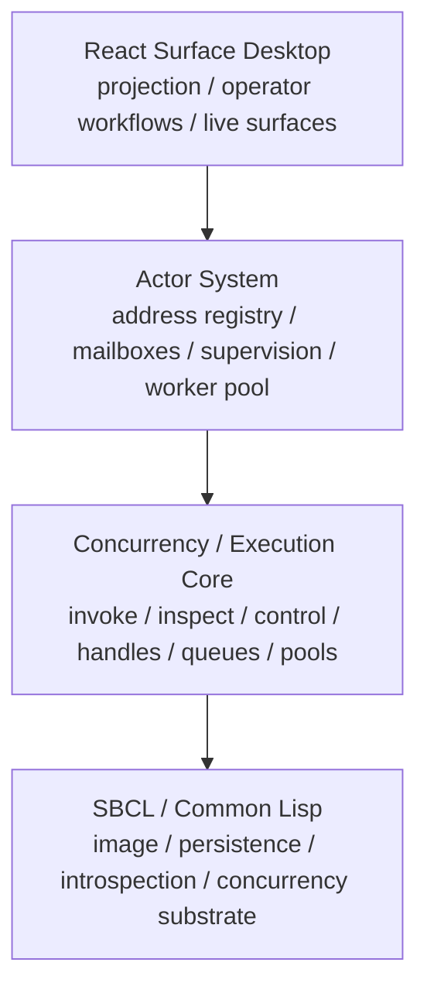
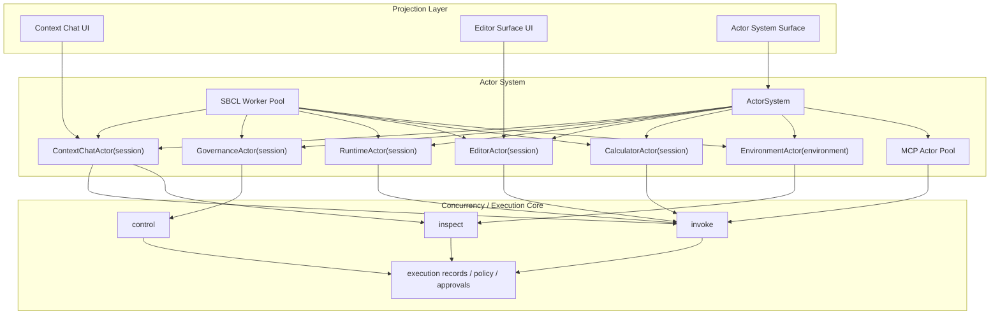
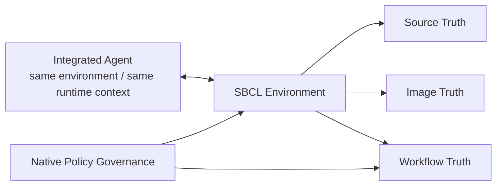
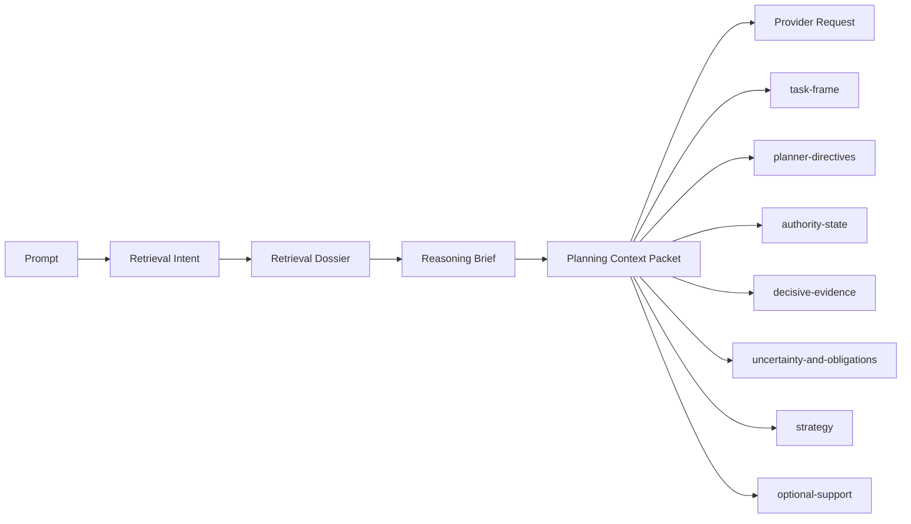
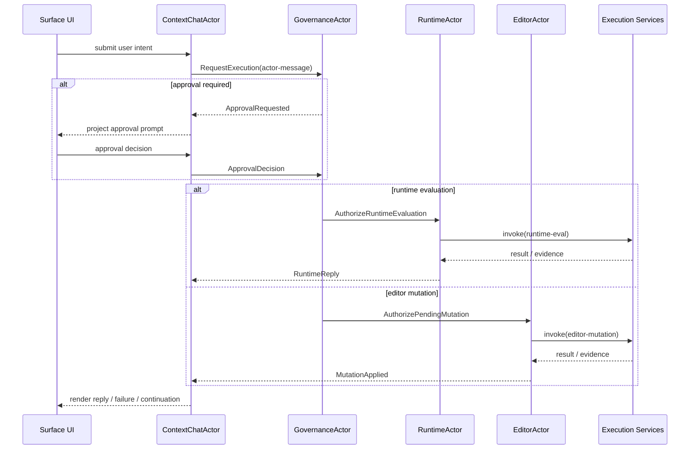
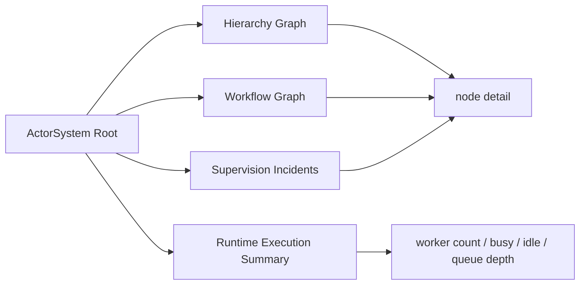

## Reading Position

Read [Foundation]({{ '/foundation.html' | relative_url }}) first if you have not already. This document maps the conceptual model onto the implementation that exists today.

It is not the best entry point for understanding why the project exists.

For the governing transition documents, read alongside this page:

- [IntentOS Constitution]({{ '/intentos-constitution.html' | relative_url }})
- [IntentOS Requirements]({{ '/intentos-requirements.html' | relative_url }})
- [UX Design System]({{ '/ux-design-system.html' | relative_url }})
- [Validation Strategy]({{ '/validation-strategy.html' | relative_url }})

## System Objective

Build a governed, transactional, image-native engineering environment that can inspect and mutate the same running system it is reasoning about while preserving reproducibility, rollback intent, provenance, and operator trust.

The current codebase now sits at a different point than the earlier transition documents described:

- the original shell-plus-streamed-ask runtime is still supported as an operator surface
- the environment-native runtime is implemented and now shapes the architecture
- the execution-service contract is implemented, with `invoke`, `inspect`, `control`, execution handles, and execution surfaces as first-class system structure

That means the right description of the codebase is no longer "prototype shell" and no longer "kernel transition underway" in the earlier sense. It is an implemented self-hosted actor environment with active enhancement and hardening work still in progress.

## Environment Framing

The new roadmap changes the right architectural center of gravity.

The system should no longer be thought of primarily as:

- a shell with agent features
- a chat runtime with tooling attached
- an IDE clone built around editor metaphors

It should instead be thought of as a persistent symbolic environment. In that framing:

- the REPL is one control surface
- conversation is one control surface
- workflows are one environment behavior
- agents are inhabitants rather than features
- artifacts are native objects rather than output formatting details

For the federated employee/contractor operating model, this environment also has a strict repository boundary:

- `RGP` owns global orchestration, policy, assignment routing, and commercial state
- `sbcl-agent` owns local execution truth and local publication behavior
- `sbcl-agent-ux` remains a pure client of `sbcl-agent` rather than a direct `RGP` client in the first pass

The current implementation is environment-oriented now. Remaining transitional structure exists mainly at compatibility and persistence boundaries, not at the level of the primary architectural center of gravity.

## Context Engineering Is Now Part Of The Architecture

The current architecture is not only layered in execution terms. It is now also layered in planning terms.

Provider-bound planning and development requests are built from a canonical planning packet rather than by handing the model a transcript plus a few ad hoc summaries. That packet is assembled from:

- retrieval intent
- retrieval dossier
- decisive evidence
- reasoning brief
- environment authority
- project authority
- workflow and incident posture

The planning packet is now a primary architectural seam because it determines how the integrated agent understands the environment it is acting inside.

## Architecture Diagrams

The following diagrams capture the current architecture more accurately than the older static kernel/chat/governance image set. The system is now best understood as a layered stack with an explicit actor runtime above a shared concurrency and execution substrate.

### Current Layered Stack

The architectural reading order is therefore:

1. `SBCL / Common Lisp`
   - foundational runtime
   - foundational persistence and introspection substrate
2. `Concurrency / Execution Core`
   - execution mediation
   - handles, futures, queues, and worker pools
   - public invoke / inspect / control services
3. `Actor System`
   - address-based capability and workflow execution
   - supervision
   - worker-pool-backed concurrency
   - actor-owned governance and effect handling
4. `Presentation Tier`
   - projection of the lower layers, not the owner of continuity

### Actor Runtime Over The Kernel

### Integrated Agent And Shared Environment

### Canonical Planning Context Packet

The authority section is now especially important. It carries:

- `agent-constitution`
- `capability-inventory`
- project context
- explicit Context Chat project selection when present
- environment and conversation continuity state

This means the integrated agent now receives a stronger statement of:

- who it is
- what constraints govern it
- what capabilities are actually available
- what project frame should dominate interpretation
- what contradictions or missing authority prevent safe progress

That is a substantive architectural change from earlier transcript-heavy prompt assembly.

### Canonical Runtime / Governance Flow

### Actor System Observability

## Preserve Capabilities, Discard Metaphors

One of the most important design constraints introduced by the new roadmap is that the project must not drift into legacy Common Lisp IDE parity as its architectural goal.

The systems worth learning from include:

- Portacle
- SLIME
- SLY
- Lem
- LispWorks
- Allegro

What matters is not reproducing their panes, menus, keybindings, or editor-centered workflow assumptions. What matters is preserving their enduring powers in a better agentic form.

The enduring powers include:

- live image intimacy
- incremental development
- symbolic introspection
- runtime-level debugging
- tight source-image navigation
- programmable environment extensibility

Those capabilities should be translated into environment-native services:

- governed execution substrates
- runtime incident workflows
- semantic graphs spanning source, image, artifacts, and work-items
- continuous validation streams
- queryable runtime and object models
- environment-native plugin and agent protocols

This is the design filter that keeps the architecture from collapsing into “LispWorks with chat” or “agentic Emacs for Lisp.”

## The Three Truths

The architecture is built around three explicit truth domains.

### Source truth

Source truth covers file-backed and reproducible state:

- source files
- patches and diffs
- tests and fixtures
- generated durable artifacts
- git state and other persistent inputs

### Image truth

Image truth covers the live SBCL image:

- loaded definitions
- packages and symbols
- object identity and heap state
- dynamic bindings
- active workers and threads
- open resources and runtime handles

### Workflow truth

Workflow truth covers the durable engineering record:

- work-items
- plans and hypotheses
- operations and approvals
- validations and replay records
- checkpoints, quarantine, and reconciliation
- operator-facing evidence

Every meaningful piece of work should answer:

- what changed in source?
- what changed in image?
- what evidence links the two?

## Current Ownership Rule

The current refactor is organized around one rule:

- conversation owns interaction state
- runtime owns execution state
- workflow owns engineering governance

This prevents conversation history from becoming a second runtime database, and it prevents runtime activity from bypassing workflow evidence. In the newer vision, these domains should all become explicit subdomains of the Environment rather than peer concepts loosely held together by the shell.

## Environment Invariant

The agent is not operating against an external target environment. The environment from which the agent draws context is the same environment in which it performs its work.

That means:

- context gathering is environment introspection
- action is environment mutation or governed observation
- governance is native to that environment
- policy is part of the execution substrate, not an after-the-fact review layer

## Actor-System Ownership Rule

The current implementation adds a stronger operational rule above the kernel:

- actors communicate by address, not by UI thread identity
- inboxes and outboxes are the primary execution surfaces
- singleton actors must resolve to one canonical session-scoped identity
- pooled work uses leased SBCL worker threads and returns them when idle
- the React tier projects actor-system state; it does not own routing or continuity

This matters because the earlier hybrid model let continuity leak across transcript state, bridge state, and renderer state. The actor-system refactor is explicitly trying to collapse that ambiguity.

## Current Runtime Shape

The codebase still exposes one shell-facing session handle, but the internal architecture now spans several real layers. That shell-facing handle is now best understood as a transitional composition root on the path toward a fuller Environment object.

The newer architecture also has a real kernel seam:

- `src/kernel-core.lisp`
- `src/kernel-service.lisp`
- `src/shell-service.lisp`

Those modules are not the whole system yet, but they are now the right place to understand the current compression effort.

### CLI and shell

Top-level entrypoints in `bin/` dispatch into the Common Lisp runtime. The interactive shell in `src/shell.lisp` accepts both:

- recognized shell commands such as `(ask ...)`, `(say ...)`, `(tool ...)`, `(thread/new ...)`, and `(turn/status ...)`
- ordinary Lisp forms for direct evaluation in the `SBCL-AGENT-USER` package

`chat -i` preserves the original interactive streamed-ask feel while the new conversation layer is introduced incrementally.

### Command normalization

`src/commands.lisp` maps recognized forms into structured command records and leaves everything else as ordinary Lisp evaluation. This compatibility rule is deliberate: the conversation runtime is an added layer, not a replacement for the REPL-backed operator model.

### Provider boundary and streaming

`src/provider-protocol.lisp` now primarily owns provider request/response protocol structures, while transport and request assembly have been split into:

- `src/provider-transport.lisp`
- `src/provider-transport-curl.lisp`
- `src/request-snapshot.lisp`

The system currently supports:

- a mock provider in `src/provider-mock.lisp`
- an OpenAI-compatible provider family in `src/provider-openai.lisp`
- Anthropic, Google/Gemini-compatible, Meta-compatible, and LM Studio/local-compatible model selection through the same provider boundary, config model, and provider-profile surface

Streaming is now more event-aware than the original shell implementation, although the OpenAI path still carries some transitional behavior while the event model continues to harden.

The provider boundary is also no longer just a startup transport choice. The current implementation now includes:

- environment-backed provider profiles
- runtime provider routing modes such as `:auto` and `:manual`
- scored candidate ranking based on prompt shape, governance posture, and cognition context
- shell and non-shell route inspection and route preview surfaces

The canonical event envelope is also tightening across conversation, runtime, workflow, and incident paths. Session-originated events now stamp stable correlation metadata such as `environment-id`, `session-id`, `run-id`, `operation-id`, `work-item-id`, `artifact-id`, and `incident-id` when that context is available. Streamed provider events now inherit the active provider-run operation, thread, and turn identity before they are logged as session or environment events. Workflow milestones such as validation completion, reconciliation creation, workflow quarantine, workflow resume, workflow closure, and incident creation now also emit canonical correlated events instead of living only inside record payloads. That gives provider runs, environment logs, workflow evidence, and operator renderers one shared correlation spine instead of relying on ad hoc payload conventions.

The summary path is also getting more environment-native. Environment summaries now expose an event-backed evidence block derived from the projected environment event log, and session-facing summary/tools can prefer that view when a session is bound to an Environment. That reduces the amount of duplicate status assembly that used to rebuild equivalent evidence from the session event list separately.

The same tightening now applies to operator-facing posture. Environment-backed status views can expose one consolidated operator evidence bundle that contains posture counts, blocked-work summaries, incident summaries, and event-backed evidence together. Shell rendering can then prefer that bundle instead of reassembling posture from separate summary fragments.

Workflow monitoring is moving in the same direction. Replay-group summaries, reconciliation summaries, and wait-state summaries can now prefer environment workflow state when it is already authoritative, while preserving compatibility fallbacks when an environment view has not been materialized yet. That keeps monitoring reads environment-first without making them brittle during transitional compatibility paths.

Task and worker monitoring now follows the same rule. Task lookup, task progress monitoring, worker listing, and worker lookup can prefer the environment agent view when that view already holds the authoritative monitoring state, instead of assuming the session-owned task and worker lists are the only monitoring source. Task enqueue, task cancellation, task execution, worker start, worker stop, and stop-all-workers now also refresh the bound environment agent domain immediately after mutation so monitoring surfaces do not depend on later read-time repair to become accurate.

Artifact handling is tightening in the same way. Artifact creation already writes through into Environment conversation/artifact state, and artifact summaries already prefer environment-owned aggregates. Artifact lookup and thread/turn artifact listing now also prefer Environment-owned artifact state when a session is bound, so operator inspection does not fall back to stale compatibility-session artifact lists.

The persistence boundary is also tighter now. Serializable environments preserve a minimal compatibility payload even when no materialized compatibility session is attached, and legacy environment files that still embed a full `agent-session` are normalized down to a compatibility payload on load before normal operation continues. That keeps compatibility state explicitly adapter-shaped at the persistence layer instead of letting full duplicated session objects remain the durable norm.

Provider request assembly is tighter as well. When a bound Environment exists, provider session/runtime/workspace/policy summaries now resolve from one environment snapshot per request instead of mixing snapshot reads with field-by-field session fallbacks. Direct session-derived fallback now remains only for the no-environment case and for request-local transcript material that is not yet part of the environment snapshot itself.

That same rule now applies to default thread and turn selection for provider requests. When the caller does not explicitly pin a thread or turn, provider context resolution now prefers the Environment conversation snapshot rather than the mutable compatibility-session defaults. The conversation-domain refresh path also now updates the underlying thread/message/turn/operation/artifact records, not only aggregate counters, so environment-owned conversational context remains usable for later request assembly and operator orientation.

Provider requests are also becoming more structured. The provider boundary now carries thread, turn, runtime, workspace, and policy context instead of relying only on a flat prompt string.

That structure now includes retrieval and cognition state as a default part of the turn path. The current implementation can classify retrieval intent, assemble retrieval dossiers, build cognition bundles, reuse prior outcomes and playbooks, and feed validation/execution strategy into provider routing and turn orchestration before the provider call is made.

### Conversation layer

`src/conversation.lisp` introduces durable interaction objects:

- `thread`
- `message`
- `turn`
- `operation`
- `artifact`

These records make interaction state explicit instead of treating transcript entries as the only durable truth. Under the new vision, they are not the architectural center by themselves; they are one subsystem within the Environment.

That subsystem now also has an explicit environment-domain module in `src/conversation-state.lisp`. The environment uses that module for conversation-domain summaries and active thread/turn orientation instead of treating conversation state as ad hoc summary logic embedded only in the environment root.

### Turn orchestration

`src/turn-orchestrator.lisp` is the new boundary between provider streaming and governed execution. It is responsible for:

- creating turn records
- updating assistant messages during streaming
- mapping assistant actions into operation records
- applying policy decisions
- pausing for approvals when needed
- resuming a turn after approval
- finalizing artifacts and turn outcomes

This is the structural shift from "one streamed response" to "one interaction lifecycle."

That lifecycle now includes resumed-turn follow-up in the implemented path: after approval-gated actions execute, a provider can be called again to continue and complete the same turn.

### Service boundary

The runtime now also has an explicit service layer. Those modules expose stable query/command entry points over the environment runtime and execution core so that the shell is not the only client path.

Concrete service modules now include:

- `src/execution-service.lisp`
- `src/environment-service.lisp`
- `src/conversation-service.lisp`
- `src/runtime-service.lisp`
- `src/workflow-service.lisp`
- `src/approval-service.lisp`
- `src/work-item-service.lisp`
- `src/incident-service.lisp`
- `src/mutation-review-service.lisp`
- `src/rgp-service.lisp`
- `src/event-service.lisp`
- `src/retrieval-service.lisp`
- `src/platform-service.lisp`

`src/service-core.lisp` provides the shared response envelope and metadata contract used by those service modules.

### Execution services

The current system is organized around governed execution services rather than a standalone kernel tier.

The intended execution-service API is:

- `invoke`
- `inspect`
- `control`

Current implementation progress already includes:

- execution-facing invoke paths for shell actions, staged assistant actions, runtime mutation, patches, tool execution, and resumed work
- execution-handle creation and registry state
- execution-handle-centered inspect and control paths
- operator shell commands that can open, inspect, and intervene through execution identity
- execution-surface derivation on top of governed executions

This is still transitional work, but it is no longer hypothetical architecture.

### Surface model and shell model

The shell is no longer just a REPL plus ad hoc reporting commands.

The current implementation now has:

- execution surfaces
- a shell workspace model
- a governance queue
- an object browser
- an inspector
- a desktop host contract

That desktop host contract is exposed through:

- `desktop/show`
- `desktop/action`
- `desktop/restore`

`sbcl-agent-ux` is now supposed to host those surfaces directly rather than reconstructing them from unrelated read models.

### Compatibility kernel

Hosted compatibility execution is no longer only a raw process-launch convenience.

The implementation now includes:

- compatibility execution classification
- compatibility list/detail service surfaces
- synchronous host-process compatibility execution
- detachable spawned host-process compatibility execution
- lifecycle posture, control posture, and runtime-loss acknowledgement for hosted compatibility executions

This is still only the first compatibility backend, but it is already a real kernel-shaped subsystem rather than a purely conceptual one.

### Developer platform

The platform layer is also now real enough to document as implemented work.

Current platform capabilities include:

- platform manifest query
- `.aop` package export
- package inspection and validation
- package import
- package activation and deactivation
- active-package queries
- applied platform profile queries
- one-step install (`validate + import + activate`)

That means the developer platform is no longer only roadmap prose. It is now an early but concrete contract surface.

`src/execution-service.lisp` is now the important bridge between interaction surfaces and governed execution semantics. It owns shared execution entry points for:

- `ask` and `say`
- staged assistant action processing
- pending assistant action execution
- direct tool invocation
- direct patch application
- provider stream event capture needed by turn execution
- retrieval-aware pre-prompt context assembly

That means the shell is no longer the semantic owner of those paths, and assistant action execution no longer bypasses the same public execution boundary that `sbcl-agent-ux` and other service clients use.

The shell now delegates most operator-visible paths through that boundary while preserving compatibility output shapes where needed.

The non-interactive CLI is increasingly participating in that same service boundary. RGP was the first concrete example, and the provider CLI now exposes service-backed `show`, `route`, `preview`, `routing`, `configure`, and `use` operations as JSON envelopes for desktop and external clients.

### Transitional session composition root

`src/session.lisp` still acts as the shell-facing composition root. It persists:

- events and transcript-like history
- pending assistant actions
- capability grants and approvals
- tasks and worker metadata
- work-items and workflow records
- conversation state that is now threaded into the shell experience

The long-term direction is to replace this session-centered composition with a clearer Environment model that owns runtimes, threads, agents, artifacts, work-items, policies, and events more explicitly while preserving one ergonomic shell handle.

The current implementation now goes further than earlier transitional versions in two specific ways:

- environment orientation paths such as `environment/status` derive active thread and turn context from Environment-owned conversation state instead of requiring a compatibility-session read
- provider request summaries prefer one Environment snapshot per request and no longer silently fall back to session-derived plan or artifact summary values when the Environment snapshot is already authoritative

The same tightening now applies at the module level for runtime state as well. `src/runtime-state.lisp` owns the primary runtime-domain builders and summaries used by the environment, which reduces how much runtime-domain logic is mixed directly into the older session/environment bridge.

The next level of that split is now in place too:

- `src/workflow-state.lisp` owns workflow-domain construction, summaries, and environment write-through for work-items and workflow records
- `src/artifact-state.lisp` owns environment-level artifact indexing and evidence summaries

That means runtime, conversation, workflow, and artifact state all now have concrete module boundaries in the codebase rather than existing only as conceptual categories inside `src/environment.lisp`.

The session-facing inspection surface has also tightened. Session summaries and session-event inspection are now more explicitly compatibility views over the bound environment:

- session thread-state reporting prefers environment-owned conversation summaries and active thread identity
- session-event inspection can serve the projected environment event log when a bound session’s local event list has drifted

That does not remove `agent-session`, but it does reduce how much the inspection surface treats it as the primary owner of truth.

### Tool and policy layer

Tools remain structured, explicit capabilities. Current tool families include:

- filesystem tools
- documentation tools
- session visibility tools
- process tools
- git tools
- patch application

Policy and capability control live in `src/policy.lisp` and `src/sandbox.lisp`. The system is designed so conversation mode does not bypass those gates.

One architectural improvement from the current cleanup is that direct tool and patch execution now run through the same execution-service entry points used by higher-level assistant actions. That does not change the underlying policy model, but it does reduce the number of privileged mutation paths that were previously assembled in shell-specific code.

### Tasks, workers, and governed workflow

`src/tasks.lisp`, `src/work-items.lisp`, and `src/workflow.lisp` hold the governed engineering layer.

That layer currently supports:

- queued tasks and background workers
- work-item lifecycle visibility
- approval requests and wait-state reporting
- validator replay groups and validator task records
- image-only outcomes
- image-to-source reconciliation records

## Interaction Modes

The target end state has multiple operator styles inside one environment, and the current implementation already spans some of them partially.

### REPL mode

The user types Lisp forms or shell commands and gets results immediately. This is the original operator surface and remains a first-class mode.

### Conversation mode

The user works through persistent threads and turns. Assistant text can stream, operations can be represented explicitly, approvals can pause the turn, and artifacts can be attached to the result.

`(say ...)` is the clearest expression of this direction today, while `(ask ...)` remains as a compatibility surface. Internally, both now share the same turn runner, so they persist the same core turn, operation, and assistant-message records.

### Workflow mode

The user or system works through governed work-items, validations, checkpoints, approvals, and reconciliations as environment-native engineering behaviors.

### Agent mode

The roadmap now explicitly anticipates governed agents as resident actors with identity, scope, capabilities, event participation, and policy boundaries.

## Native Environment Entities

The new roadmap identifies a better set of architectural primitives than shell commands or editor metaphors:

- Environment
- Runtime
- Thread
- Turn
- Operation
- Artifact
- Work-Item
- Agent
- Policy
- Reconciliation Record

The current codebase implements several of these already. The main gap is that they do not yet live under one explicit Environment object in code.

## Genera-Like Territory, Not Nostalgic Reproduction

The roadmap is pointing toward conceptual territory closer to Genera than to a modern IDE, but that comparison needs to be used carefully.

The point is not to recreate old Lisp machine UX. The point is to recover a deeper architectural lesson:

- the environment itself can be the primary programmable artifact

The modernized form differs in important ways:

- it is inherently multi-actor because governed agents are part of the system
- conversation is a native interaction substrate
- governance, validation, checkpoints, approvals, and evidence matter far more explicitly
- the broader environment may span filesystems, processes, services, and external models rather than one isolated image

So the goal is not “build Genera again.” The goal is to build a modern agentic Lisp environment that occupies similar conceptual territory while responding to contemporary operational and governance needs.

## Transactional Engineering Model

The workflow architecture still centers transactional discipline rather than unconstrained autonomy.

The intended loop is:

1. inspect source and image
2. plan bounded mutations
3. checkpoint relevant state
4. mutate deliberately
5. observe runtime effects
6. validate in-image
7. validate from a colder baseline
8. reconcile differences
9. commit, quarantine, or roll back

Not every part of that loop is equally mature in code today, but the work-item and workflow systems already preserve the design intent and evidence model.

## Artifacts and Evidence

One of the important changes in the current refactor is that useful outputs are becoming explicit records rather than only transcript text.

The artifact model currently covers conversation-visible results such as:

- files
- patches and diffs
- operation outputs
- validation summaries
- checkpoints and reconciliation records
- plan-like or summary records linked to turns

The implementation is still growing, but the direction is clear: if the assistant changed or validated something important, that outcome should be representable as a durable artifact.

## Safety Model

### Capability gates

The runtime uses explicit capability grants for stateful operations. Important current gates include:

- `:safe-read`
- `:process-run`
- `:git-read`
- `:git-write`
- `:runtime-eval-safe`
- `:runtime-eval-mutate`
- `:workspace-write`

The conversation runtime is being built to consume the same gates rather than creating a second, less-governed execution path.

### Approval checkpoints

Assistant-proposed actions and certain turn operations can pause in an approval state. The user can then inspect the turn and explicitly resume it. Governed mutation turns now create or attach workflow evidence more directly, including work-item linkage and checkpoint metadata before execution continues.

### Checkpointing, replay, and reconciliation

The work-item system already models checkpoint-like metadata, replayable validation records, and image reconciliation. These remain part of the core architecture because live-image success is not enough on its own.

## Module Map

The current source tree maps to the architecture like this:

- `src/main.lisp`: CLI dispatch and top-level commands
- `src/commands.lisp`: shell command normalization
- `src/shell.lisp`, `src/repl.lisp`: operator interface and command execution
- `src/execution-service.lisp`: shared interaction and mutation execution boundary
- `src/provider-protocol.lisp`, `src/provider-mock.lisp`, `src/provider-openai.lisp`: provider boundary
- `src/conversation.lisp`, `src/turn-orchestrator.lisp`: conversation and turn lifecycle
- `src/session.lisp`, `src/events.lisp`, `src/tasks.lisp`: runtime state, event log, tasks, workers
- `src/tools-*.lisp`: structured capability surface
- `src/policy.lisp`, `src/sandbox.lisp`, `src/patch.lisp`: execution governance and mutation controls
- `src/work-items.lisp`, `src/workflow.lisp`: governed engineering records

## What Is Implemented Versus Planned

Already implemented in code:

- Common Lisp shell and direct Lisp evaluation
- provider abstraction and streaming support
- thread, message, turn, operation, and artifact records
- shell commands for threads, `say`, turn status, and turn resume
- approval-aware turn orchestration
- an execution service layer shared by shell interaction, direct tool/patch execution, and assistant action execution
- persisted session state, tasks, workers, work-items, replay, and reconciliation

Still partial or still planned:

- a fully separated internal conversation/runtime/engineering state model
- a richer event bus that fully eliminates transitional in-band control behavior
- a service-native external API surface over the execution/service layer for remote UX clients
- stronger artifact coverage and workflow binding for every mutating turn
- deeper rollback and cold-start reproducibility orchestration

Those are roadmap items, not hidden assumptions. See [Implementation Plan]({{ '/implementation-plan.html' | relative_url }}) for sequencing.
