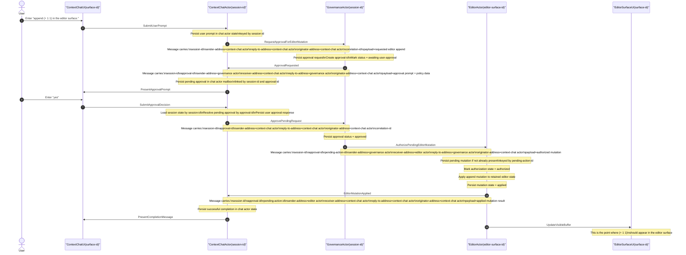

# Actor Model Sequence: Context Chat -> Governance -> Editor

This document replaces the earlier hybrid diagram with a proper actor-based sequence.

It models the requested flow for:

- user message: `append (+ 1 1) in the editor surface.`
- approval reply: `yes`

The purpose of this sequence is not to mirror incidental renderer/service plumbing. It is to define the correct actor contract that the system should implement.

## Actor System Principles

This sequence assumes the following rules:

1. Every asynchronous message is self-describing.
2. Every actor owns and persists its own state.
3. No actor depends on reconstructing continuity from UI thread matching.
4. Downstream actors always receive the source actor address they must reply to.
5. Correlation state is carried in messages, not rediscovered externally.

## Required Message Fields

Every message in this flow must carry enough state to be handled independently:

- `message-id`
- `message-type`
- `session-id`
- `conversation-id`
- `approval-id` when governance is involved
- `pending-action-id` when editor mutation is involved
- `sender-address`
- `receiver-address`
- `reply-to-address`
- `originator-address`
- `causation-id`
- `correlation-id`
- `payload`

## Actors

- `ContextChatActor(session-id)`
- `GovernanceActor(session-id)`
- `EditorActor(editor-surface-id)`
- `ContextChatUI(surface-id)`
- `EditorSurfaceUI(surface-id)`

The UI surfaces are not the actors. They are views/controllers attached to actors.

## Actor-Owned State

### ContextChatActor owns

- chat session state keyed by `session-id`
- user-visible message history for that chat session
- pending governance approval requests for that chat session
- links from `session-id` to UI surface ids currently presenting that session

### GovernanceActor owns

- approval request records keyed by `approval-id`
- approval policy decisions
- approval status lifecycle
- authorized downstream execution grants

### EditorActor owns

- pending mutation requests keyed by `pending-action-id`
- mutation payloads
- authorization state for each pending mutation
- applied mutation history
- links to editor surface state/buffer state

## Target Actor Sequence

## Correct Actor Transition Breakdown

### 1. User request enters the system

The UI must not be the source of continuity. It forwards the prompt to `ContextChatActor(session-id)`.

The chat actor persists:

- the original prompt
- the active `session-id`
- the target semantic intent
- the source UI binding

### 2. Governance approval is requested

`ContextChatActor` sends a governance request message.

Governance must not infer who to answer by actor class alone. It must be told:

- exact `sender-address`
- exact `reply-to-address`
- exact `originator-address`

That is mandatory if multiple chat actors can exist at once.

### 3. Governance requests user approval

`GovernanceActor` persists an approval record and sends an explicit `ApprovalRequested` message back to the `ContextChatActor`.

The chat actor persists that mailbox entry in its own state and then instructs the UI to render the approval prompt.

### 4. User approves

The UI sends `SubmitApprovalDecision` to the same `ContextChatActor(session-id)`.

The chat actor does not need to match a thread. It already owns:

- the `session-id`
- the pending approval mailbox entry
- the `approval-id`

### 5. Governance authorizes editor mutation

Once governance approves, it sends an explicit authorization message to the `EditorActor`.

That message must carry:

- `approval-id`
- `pending-action-id`
- `sender-address`
- `reply-to-address`
- `originator-address`

The editor actor uses `pending-action-id` to load or create the pending mutation state it owns.

### 6. Editor applies mutation

`EditorActor` persists and applies the mutation itself.

This is where the editor-visible update should actually happen.

The editor actor then emits a completion message back to the `ContextChatActor` so the chat session can narrate the result.

## Where The Update Should Occur

The editor surface should update at this actor step:

- `EditorActor -> EditorSurfaceUI: UpdateVisibleBuffer`

This must happen only after:

- editor-owned pending mutation state exists
- governance authorization has been received
- the editor actor has marked the pending action as authorized

## What Was Wrong With The Previous Diagram

The previous diagram was implementation-centric, not actor-centric. It mixed:

- renderer internals
- bridge internals
- service call plumbing

with the logical message flow.

That is not sufficient for actor design because it obscures:

- who owns state
- which message is authoritative
- which actor is responsible for persistence
- which address a downstream actor should reply to

## What This Implies For Implementation

To match this sequence, the implementation must enforce:

1. `ContextChatActor(session-id)` is the owner of chat continuity.
2. `GovernanceActor(session-id)` is the owner of approval continuity.
3. `EditorActor(editor-surface-id)` is the owner of pending mutation continuity.
4. The UI must be a projection over actor state, not a continuity source.
5. Thread ids may exist as presentation artifacts, but they cannot be required for inter-actor continuation.

## Next Diagnostic Check

When the live system is tested, every hop should be traceable as actor messages:

1. `SubmitUserPrompt`
2. `RequestApprovalForEditorMutation`
3. `ApprovalRequested`
4. `SubmitApprovalDecision`
5. `ApprovePendingRequest`
6. `AuthorizePendingEditorMutation`
7. `EditorMutationApplied`
8. `PresentCompletionMessage`
9. `UpdateVisibleBuffer`

If any of those messages is missing, delayed, addressed incorrectly, or missing correlation fields, the actor flow is broken.
