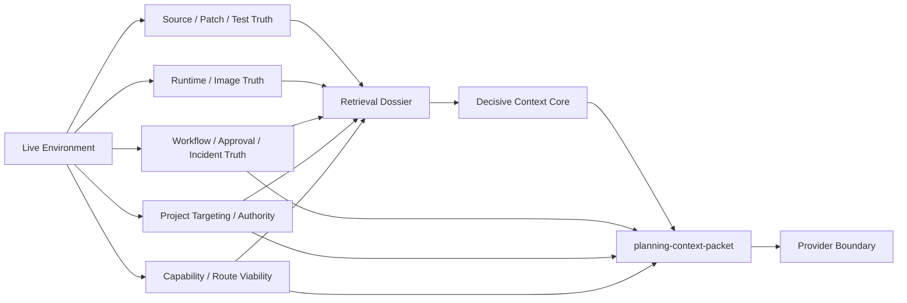
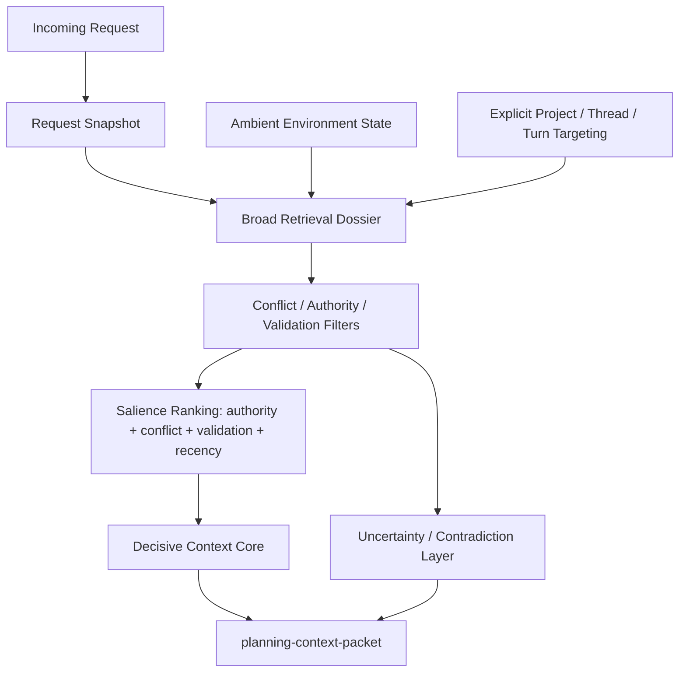
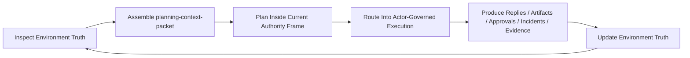

## Why This Matters

`sbcl-agent` no longer treats model context as an unstructured dump of transcript, tool output, and loose summaries.

For long-horizon planning and governed execution, the runtime now builds one canonical planning substrate that answers five questions explicitly:

1. who the system is and what it is allowed to do
2. what environment and capability surface is live right now
3. what project and workflow frame of reference should govern the request
4. what evidence is decisive rather than merely relevant
5. what uncertainty blocks safe planning or execution

This context model matters because the integrated agent is self-hosted. It is not reasoning about an external target through stale proxies alone. It is reasoning from inside the same governed environment it can inspect and mutate. That raises the bar:

- context has to describe the actual live environment
- context has to describe current authority, not assumed authority
- context has to carry workflow and approval posture, not just code facts
- context has to remain legible enough that an operator can understand why the agent acted

It also changes what "context" means. The environment is not just a source of facts that the agent samples occasionally. The environment is an integrated part of the agent's dynamic context:

- the agent reads runtime, workflow, approval, and evidence state from the live environment
- the agent acts from inside that same environment
- those actions create new state inside that same environment
- the next planning packet is then built from the updated environment

That is the full feedback cycle. The agent is not outside the system looking in. The agent is inside the system, and the environment itself is part of the reasoning substrate.

## Canonical Planning Context Packet

Provider-bound planning requests now flow through a canonical `planning-context-packet` with these sections:

- `:task-frame`
- `:planner-directives`
- `:authority-state`
- `:decisive-evidence`
- `:uncertainty-and-obligations`
- `:strategy`
- `:optional-support`

This packet is built in the shared request-snapshot layer and then consumed by the provider boundary. It is not an OpenAI-only formatting trick.

It is also not just prompt assembly. It is the point where runtime truth, workflow truth, governance truth, and project truth are integrated into one actionable planning surface.

## How Context Is Produced

The important implementation detail is that context is not produced by one prompt-template pass at the edge of a provider call.

It is produced as a layered integration process:

1. the live environment exposes current runtime, source, workflow, governance, and evidence state
2. request-snapshot and inspection layers gather the relevant current facts for the active request
3. retrieval narrows the broad dossier down to decisive context rather than merely related material
4. project, work-item, incident, approval, and capability posture are merged into the same planning frame
5. the planning packet is assembled as one explicit execution substrate for the provider boundary

That matters because every layer is allowed to veto the fiction that the system already knows enough.

If the environment is stale, if provider-route viability is degraded, if project alignment is ambiguous, or if approval posture is unresolved, those conditions should survive into planning as first-class context rather than being flattened away by transcript summarization.

### Content Integration Process

The current content integration path can be visualized like this:



The important detail is that retrieval is not the whole context system. It is one stage in a larger integration pipeline that starts from environment truth and ends in a planning packet.

## Context Dimensions

The current system is intentionally multidimensional. "Context" is not just conversation history plus a retrieval bundle.

The environment contributes several distinct dimensions:

- source dimension
  - files, forms, patches, definitions, tests, and durable artifacts
- image dimension
  - loaded packages, symbols, classes, generic functions, runtime objects, bindings, workers, and active handles
- workflow dimension
  - threads, turns, work-items, incidents, approvals, checkpoints, replay state, and recovery posture
- governance dimension
  - policy identity, approval requirements, capability boundaries, escalation posture, and validation obligations
- project dimension
  - constitutions, requirements, readiness, current targeting, and project-specific ambiguity
- evidence dimension
  - decisive observations, validation outputs, artifacts, event history, and recent mutation consequences
- capability dimension
  - route viability, dependency posture, package-management posture, runtime readiness, and anomaly summaries
- uncertainty dimension
  - missing authority facts, stale-context suspicion, conflicts, unknowns, and next inspection obligations
- strategy dimension
  - task archetype, risk posture, execution bias, review burden, and recovery/validation shaping

Those dimensions are not interchangeable. Source truth cannot answer approval posture. Conversation history cannot answer provider-route viability. A runtime browser result cannot answer project authority. The system has to preserve those distinctions or the agent will plan from a collapsed and misleading view of reality.

## Authority State

The `authority-state` section now carries the stable and live context the agent should treat as authoritative before reaching for supporting narrative:

- `agent-constitution`
- `capability-inventory`
- project authority
- thread and turn context
- environment summary
- explicit Context Chat project targeting when present

The important architectural point is that `authority-state` is not static policy text. It is assembled from the current introspective environment and current workflow/governance state.

### Agent Constitution

The system now carries a durable `agent-constitution` through the environment:

- identity
- system role
- governance posture
- objectives
- optimization priorities
- hard invariants
- self-improvement boundaries

This closes the earlier gap where the system behaved constitutionally but did not carry a first-class durable statement of identity and purpose.

### Capability Inventory

The environment also now exposes a planner-grade `capability-inventory`, including:

- readiness summary
- provider-route viability
- executable readiness
- missing prerequisites
- dependency anomalies
- package-management posture
- anomaly summaries

This gives the planner a live view of what the agent can actually do, not just what tools exist in theory.

That distinction is essential in a self-hosted runtime. The interesting failure mode is often not “tool missing” but:

- capability exists in principle
- environment state is stale, partial, or contradictory
- authority is insufficient for the requested mutation
- the workflow posture requires approval or colder validation

## Project Context

Project context is no longer only inferred from prompt text or retrieved dossier fragments.

The runtime now supports:

- ambient current project selection
- retrieval-derived project alignment
- explicit Context Chat project targeting with zero, one, or many selected projects

Explicit targeting is persisted in session/environment state and can be inspected or changed from the shell and desktop-task service surface.

When project selection is ambiguous, the system now degrades confidence and promotes that ambiguity into the uncertainty layer instead of pretending the project frame is stable.

## Decisive Evidence

Retrieval still collects a broad dossier, but planning no longer starts from broad relevance alone.

The dossier now derives a `decisive-context-core` that favors:

- blockers
- validation obligations
- incidents
- recent mutation consequences
- source/runtime symbol targets
- durable intent constraints
- project constraints
- prior conversational anchors when they govern interpretation

This helps keep context integration bounded. The agent should not see everything equally. It should see the facts most likely to govern safe execution in this environment right now.

Salience is explicitly weighted for:

- authority strength
- conflict potential
- validation criticality
- recency

### Context Search And Selection In The Current Stage

The current stage of development should be understood as a search-and-selection pipeline rather than a final solved semantic understanding layer:



At the current stage, the system is strong at:

- integrating multiple truth domains
- narrowing broad retrieval to decisive material
- preserving uncertainty and contradiction as first-class planner input

It is still improving on:

- deeper semantic project disambiguation
- more exhaustive contradiction classes
- richer learned relevance across long-running multi-project work

## Uncertainty And Contradictions

The reasoning layer now emits structured uncertainty rather than a single loose “unknowns” bucket.

It distinguishes:

- missing authority facts
- decisive unknowns
- authority conflicts
- stale-context suspicions
- next inspection obligations

High-value contradiction classes now include:

- multi-project ambiguity
- project-readiness versus capability-posture conflicts
- project/work-item linkage gaps

Those signals are then promoted into planner directives and escalation logic.

## Strategy And Risk Shaping

The packet is not static across tasks.

It now changes shape by:

- task archetype
- risk posture
- governance burden
- validation burden

For example:

- debugging requests bias toward inspection and explanation first
- implementation requests bias toward planning, mutation, and validation
- recovery requests bias toward checkpoint-backed continuation and replay
- high-risk or low-authority contexts escalate into a more conservative planning posture automatically

## Self-Hosted Context Integration

The project’s context model should be understood as self-hosted context integration:

1. the environment exposes runtime, source, workflow, and governance state
2. retrieval and inspection gather the decisive subset of that state
3. the planning packet turns it into an explicit execution frame
4. the integrated agent reasons inside that frame
5. actor-governed execution returns new evidence, incidents, approvals, or artifacts back into the same environment

The critical point is that step 5 is not just output handling. It closes the loop. The environment that supplied the context is also the environment that absorbs the consequences of the agent's action, which means the next request is shaped by the new environment state rather than by a disconnected transcript recap.

That loop is what makes `sbcl-agent` different from a transcript-first agent shell:

- the environment is not just the place where actions happen
- the environment is also the authoritative source of planning context

### Planning Workflow Agent Loop

The current planning workflow agent implementation can be visualized as a closed, introspective loop:



That is the self-contained iterative process. Planning is not upstream of the environment and execution is not downstream of context. They are coupled through one environment that continuously re-materializes the next planning surface from the consequences of the previous action.

## How The Agent Consumes Context

The agent does not consume this environment as an undifferentiated memory blob.

It consumes it through explicit planning surfaces:

- `task-frame`
  - what is being asked and what kind of work this is
- `authority-state`
  - who the agent is, what it is allowed to do, and what environment/project/workflow state is authoritative
- `decisive-evidence`
  - what facts should govern action now
- `uncertainty-and-obligations`
  - what the agent still does not know and what it must inspect, validate, or escalate before acting
- `strategy`
  - how cautious, validation-heavy, or mutation-forward the plan should be

That is why the environment is not just "available to tools." It is upstream of reasoning. The planning substrate is already shaped by environment truth before the agent commits to a response or an action.

## Why This Is Hard To Reproduce Externally

An externalized coding agent usually works by:

1. observing a partial file tree or tool transcript
2. making remote calls into target systems it does not inhabit
3. reconstructing state from serialized tool responses
4. losing part of the consequences of each action between calls

That model can still be useful, but it is structurally looser.

`sbcl-agent` is tighter because:

- the runtime being inspected is the same runtime the agent uses to act
- workflow, approvals, incidents, and artifacts are part of that same environment rather than side systems
- consequences of execution return into the same environment as new evidence
- the next plan is built from updated environment truth rather than from a retrospective summary of tool output

This is not just a UX distinction. It changes the control loop itself. The agent is not orchestrating a foreign system through lossy boundaries. It is participating in one governed, introspective environment whose state can be re-read immediately after action.

## Governance In Context

Governance is part of the planning substrate itself.

The planning packet is expected to expose:

- policy identity
- approval posture
- capability readiness
- contradictory or missing authority
- validation obligations
- prior incident or recovery state when relevant

This means the agent should not discover governance only after deciding what it wants to do. Governance shapes what the agent plans in the first place.

## Context Chat Project Targeting

The operator can now explicitly bind the Context Chat frame of reference to projects:

```lisp
(desktop-task/set-context-chat-projects
  :project-ids '("project-a" "project-b")
  :primary-project-id "project-a")

(desktop-task/context-chat-context)
```

This is intentionally optional:

- zero selected projects is valid
- one selected project is valid
- many selected projects is valid

The distinction between `:explicit`, `:ambient`, and `:none` selection source is preserved in the planner authority state.

## Current Strength

At this point the system is strong in all five context-engineering categories needed for long-horizon planning and execution:

1. durable self-constitution
2. fully introspective operating state
3. project-specific authority and differentiation
4. live environment capability/dependency posture
5. relevance-guided retrieval and canonical planning-context packaging

The remaining work is refinement:

- deeper semantic project disambiguation
- more exhaustive contradiction classes
- broader warning cleanup and documentation upkeep
