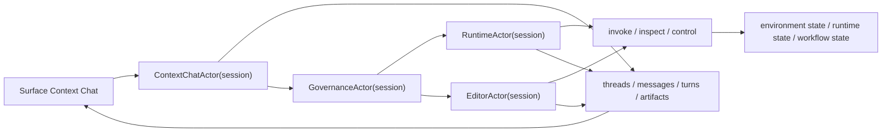

## Reading Position

This document should be read after [Foundation]({{ '/foundation.html' | relative_url }}) and [Architecture]({{ '/architecture.html' | relative_url }}).

It explains one subsystem of the environment, not the whole project.

## Intent

This document defines the conversation-runtime architecture that evolves `sbcl-agent` from a shell with streamed ask into a persistent conversation subsystem backed by the same SBCL image and workflow-governed engineering model.

It is intentionally not a plan to replace the existing shell. The shell, direct Lisp evaluation, capability gates, work-items, and background execution model remain strengths that the conversation layer should preserve.

The newer roadmap narrows the role of this document: conversation is now one native medium within the Environment rather than the singular destination of the architecture.

## Conversational Context Architecture

The conversation subsystem is no longer best described as “chat plus transcript.” It is now routed through the actor system and governed kernel.

## Ownership Rule

The architectural rule is:

- conversation owns interaction state
- runtime owns execution state
- workflow owns engineering governance

That rule is the cleanest way to align the conversation runtime with the project's source truth, image truth, and workflow truth model.

The actor-system refactor adds one more practical rule:

- conversation owns interaction continuity through `ContextChatActor`, not through whichever renderer thread happens to be selected

## What Exists Today

The codebase already implements part of this blueprint.

Present in code now:

- durable `thread`, `message`, `turn`, `operation`, and `artifact` records in `src/conversation.lisp`
- thread-aware shell commands in `src/commands.lisp` and `src/shell.lisp`
- `say` as a conversation-first command
- `ask` routed through the same turn runner with `:repl-bridge` operator semantics
- `turn/status` and `turn/resume`
- incident recording and inspection with `incident/list` and `incident/show`
- `incident/show` expanded into a compact incident workspace view with linked thread, turn, operation, work-item, and workflow summaries when available, plus recovery and wait guidance for operator follow-through
- turn orchestration in `src/turn-orchestrator.lisp`
- canonical provider-event normalization in `src/provider-protocol.lisp`
- governed mutation binding for patches, mutating eval, and write-class tool actions
- provider follow-up after turn resume, with follow-up lifecycle metadata and events
- incident-aware turn detail, recovery summaries, and workflow quarantine behavior for failed governed runtime actions
- load-time interruption recovery that marks persisted in-flight turns and operations as `:interrupted` instead of pretending they are still active
- explicit `:awaiting-cold-validation` runtime/workflow state for governed runtime mutations that succeed in the warm image but still require colder evidence before durable closure
- compact environment-backed provider context, so provider requests now carry environment refs instead of only flat session summaries
- validation and image-reconciliation artifact emission for thread-bound work-items, so governance evidence appears in the conversational artifact stream instead of only inside workflow records
- environment-first persistence where conversation records, workflow records, incident state, task/worker state, staged actions, operator plan, and policy grants are rehydrated from environment-owned domains instead of a duplicated serialized session blob
- a minimal compatibility-session payload that now acts primarily as a session identity shim rather than as the primary durable source of runtime truth

Still transitional:

- the top-level mutable state is still partly organized through `agent-session`, but environment-owned summaries, events, artifacts, workflow state, agent state, and provider context now carry much more of the system’s operational truth than earlier transitional versions
- event flow is more structured than before, though some legacy paths still need cleanup
- runtime and workflow operations are now materially exposed through the shared execution and service boundary, with remaining work focused on consistency and polish

That maturity statement matters. The conversation subsystem is real and usable now, but it is still part of a broader architectural migration rather than a finished isolated product.

## Place in the Larger Architecture

Conversation is still important, but it is no longer the whole architectural frame. In the new vision:

- Environment becomes the top-level object
- Runtime, Thread, Artifact, Work-Item, Agent, and Policy become peer native entities
- conversation remains the subsystem that gives threads, turns, and conversational coordination their structure

## Runtime Shape

The current shell still keeps one live session handle, but the intended structure is compositional.

### Practical composition root

The code effectively needs one shell-facing runtime object with these responsibilities:

- provider
- tool registry
- policy engine
- event bus
- conversation manager
- runtime manager
- engineering manager

That can remain one ergonomic shell handle while still separating internal ownership.

## Conversation Domain Objects

The conversation layer is built around durable records instead of transcript-only history.

### Thread

A long-lived conversation container.

Responsibilities:

- title and identity
- message membership
- turn membership
- artifact linkage
- summary and last-activity state

### Message

A durable utterance or tool/runtime narration.

Responsibilities:

- role tracking
- text or structured content
- stream fragments during generation
- finalized state

### Turn

One user interaction lifecycle.

Responsibilities:

- the user message and assistant message relationship
- status transitions
- operation linkage
- artifact linkage
- approval pause and resume state
- terminal outcome

### Operation

A runtime or tool action associated with a turn.

Responsibilities:

- action kind
- input and output
- policy decision
- execution status
- linkage to created artifacts

### Artifact

A user-visible output of a turn or operation.

Responsibilities:

- kind, title, and summary
- optional path or diff target
- linkage to thread, turn, operation, and work-item
- source/image references where relevant

## Turn Lifecycle

Conversation mode is a workflow, not a single streamed string.

Recommended state model:

- `:initialized`
- `:building-context`
- `:streaming-assistant`
- `:awaiting-operation-dispatch`
- `:running-operations`
- `:awaiting-approval`
- `:awaiting-provider-resume`
- `:finalizing`
- `:completed`
- `:failed`
- `:cancelled`

The current implementation covers the most important lifecycle and approval-aware completion states, with remaining work focused on refinement rather than first implementation.

## Turn Orchestrator Responsibilities

The turn orchestrator is the bridge between provider text generation and governed execution.

Its responsibilities are:

1. Resolve the current thread and turn context.
2. Build provider input from conversation and runtime summaries.
3. Create and update assistant message state during streaming.
4. Record structured operation intents when the assistant proposes actions.
5. Apply policy decisions and pause when approval is needed.
6. Resume the turn after approval.
7. Optionally resume the provider after the operation phase when the provider supports structured turn follow-up.
8. Finalize turn, operation, and artifact state.

This keeps behavior in Lisp rather than encoding it in prompt tricks.

In the current architecture, the orchestrator also has to preserve actor-native continuity:

1. resolve the canonical session-scoped actor identities
2. stamp actor messages with sender, receiver, reply-to, and originator addresses
3. attach runtime or editor actor-flow state to the resulting turn payload
4. project actor replies back into conversation records without making the transcript the routing backbone

## `ask` and `say`

The migration strategy is compatibility first.

- `(ask ...)` remains supported as the original shell-oriented interaction
- `(say ...)` is the conversation-first entrypoint
- both commands now share one conversation turn runner and persist the same core turn records

The long-term design is for `ask` to remain a thin compatibility surface while the runtime increasingly treats thread-and-turn interaction as the primary operator model.

## Event-Native Streaming

The conversation runtime depends on one architectural rule:

- assistant-visible text is only assistant-visible text
- tool intents, operation progress, approvals, and artifacts are sibling events

This is partly implemented now through provider-event normalization and shell handling, but the OpenAI-backed path still contains transitional behavior. The goal is to let the orchestrator and shell consume one canonical event stream regardless of provider specifics.

The event model now also includes explicit follow-up lifecycle signals for resumed turns, which keeps provider continuation visible without collapsing it into assistant text.

The current implementation also distinguishes interrupted recovery from approval-gated recovery in turn status rendering. A recovered turn can therefore show both resumable approval work and interrupted in-flight work explicitly instead of collapsing everything into one generic recovery bucket.

## Relationship To Workflow Governance

Conversation does not replace work-items. It feeds them.

Rules of thumb:

- a read-only turn may not need a work-item
- a mutating turn should usually create or attach to governed workflow state
- approval-gated mutation turns should record checkpoint and approval evidence before execution continues
- validation, reconciliation, quarantine, and replay remain workflow-owned concerns

Governed runtime mutations now follow a stricter sequence than the earlier blueprint implied:

- warm-image execution can record successful live validation
- the resulting work-item may still remain in `:awaiting-cold-validation`
- operator-facing waiting summaries call this out as cold-validation-required work
- durable closure only happens after colder validation succeeds

This matters because the value of the system is not just that it can chat about changes. The value is that it can preserve evidence about what it changed and why the result should be trusted.

## Environment-First Persistence

The current implementation now leans much harder toward Environment as the durable root object.

Environment-owned state now includes:

- runtime summaries and runtime history
- threads, messages, turns, operations, and artifact records
- work-items and workflow records
- incident state
- staged actions
- task and worker snapshots
- capability-grant summaries
- operator plan state

The compatibility session still exists, but its persistence role has been reduced substantially.

Today the compatibility payload is intentionally thin:

- it preserves session identity
- it allows a session-shaped API surface to be reconstructed on load
- it no longer stores duplicate copies of transcript, events, threads, messages, turns, operations, artifacts, work-items, workflow records, pending actions, incidents, tasks, workers, grants, or plan state
- it no longer stores duplicate header values either; `cwd`, `package`, and `current-thread-id` are now reconstructed directly from Environment state during load

This is an important conceptual shift. The environment is no longer merely a projected view of the session. The session is increasingly a compatibility view derived from the environment.

## Current Gaps

The biggest remaining gaps in the conversation architecture are:

- cleaner internal separation of conversation, runtime, and engineering state
- richer operation coverage beyond the current assistant-action and tool-oriented paths
- fuller artifact surfacing for every validation and reconciliation path, especially outside thread-bound work-items
- governed runtime tooling for image-native inspection and mutation
- deeper incident-workspace capabilities beyond compact linked summaries and next-action guidance, such as richer object/state capture and restart-oriented recovery flows
- eventual removal or further contraction of the compatibility-session layer once external command and shell surfaces can rely more directly on Environment-native APIs

## End State

When this blueprint is fully realized, `sbcl-agent` will support:

- REPL mode for direct Lisp and shell-style request-response work
- conversation mode for persistent thread-based interaction

on one common SBCL-native runtime, with workflow records still governing mutating engineering activity.
