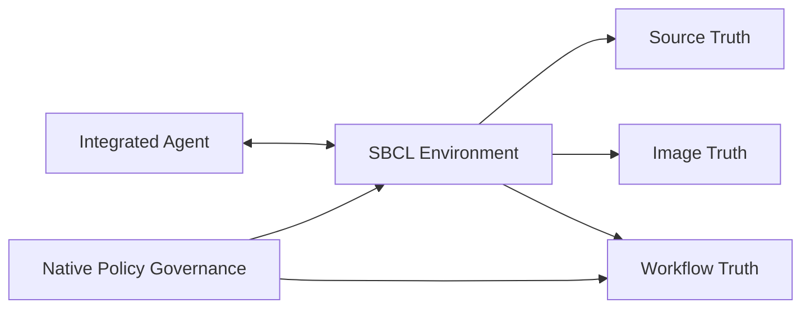
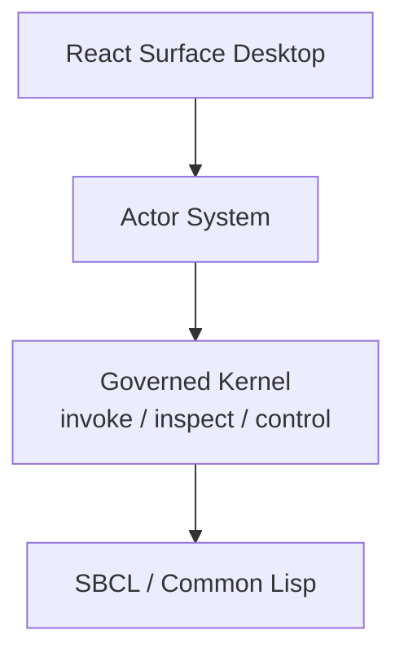
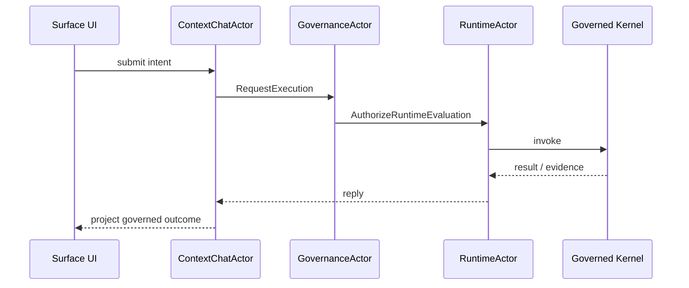

## What the System Is

`sbcl-agent` is a persistent, SBCL-native engineering environment.

Today, that environment is implemented as a real Common Lisp runtime with:

- a CLI and REPL-oriented shell
- direct runtime inspection and evaluation
- durable conversation objects such as threads, turns, operations, and artifacts
- governed workflow records, work-items, approvals, incidents, and reconciliation paths
- an explicit `environment` object that is now the primary architectural container for those domains, with compatibility-session structure retained only where transitional adapters still exist

## What the System Is Not

It is not best understood as:

- a chatbot with tools
- a thin wrapper around an LLM API
- a conventional IDE recreated in Lisp
- a finished external ecosystem with every enhancement and backend variation already complete

The codebase is mature enough to demonstrate the model, support real operator flows, and satisfy the accepted target architecture. What remains is enhancement, hardening, and ecosystem depth rather than unresolved core architecture.

## Runtime as Substrate

The live SBCL image is part of the engineering substrate, not disposable infrastructure.

That matters because the runtime holds truths that source files alone do not:

- loaded definitions
- package and symbol state
- object identity
- worker and thread activity
- dynamic bindings
- warm caches and other live resources

This is the main reason `sbcl-agent` can justify an environment-first architecture instead of a file-first agent architecture.

## Realtime Introspective Environment Architecture

The following diagram makes that claim concrete. Traditional agents stand outside the target environment and manipulate it through APIs, shells, filesystems, browsers, and logs. `sbcl-agent` instead runs the agent inside the same live SBCL environment, where runtime state, memory, governance, evidence, and the Surface UI are all part of one introspective and persistent world.

## Execution Kernel Architecture

The kernel architecture below shows how that environment is operationalized: one environment contains the execution kernel, the core domains, the durable event and persistence spine, and the public services consumed by shell and desktop surfaces.

## The Three Truths

The project is organized around three linked truth domains.

### Source Truth

Source truth is the durable, reproducible file-backed world:

- source files
- diffs and patches
- tests
- generated durable artifacts
- git state

### Image Truth

Image truth is the live runtime world:

- loaded code
- heap state
- symbol and package state
- active workers and threads
- runtime resources

### Workflow Truth

Workflow truth is the governed engineering record:

- work-items
- workflow records
- approvals
- validation results
- incidents
- reconciliation artifacts

These truths should not be collapsed into one another. They should be related explicitly.

## Governance as an Intrinsic Property

Governance is not an optional wrapper around the system.

The architecture assumes that useful runtime mutation must be:

- observable
- policy-mediated
- approval-aware where necessary
- linked to evidence
- reconcilable back to durable source truth

That is why workflow records, incidents, approvals, and artifacts exist as native concepts in the codebase rather than as external documentation concerns.

## Governance Architecture

The governance model is architectural, not merely procedural. Policy evaluation, approvals, work-items, incidents, evidence, validation, and recovery all live inside the same environment loop.

The older static PNG diagrams have been retired from the primary docs in favor of the Mermaid-backed architecture pages:

- [Architecture and Design]({{ '/architecture.html' | relative_url }})
- [Actor Runtime And Governed Kernel]({{ '/robust-actor-kernel-architecture.html' | relative_url }})
- [Actor System Surface]({{ '/actor-system-panel.html' | relative_url }})

## Current Maturity

The present system should be understood as:

- implemented enough to operate as a real shell, provider runtime, conversation runtime, compatibility kernel, desktop host, and governed workflow substrate
- architecturally environment-first, with `agent-session` compatibility retained only where adapter and persistence bridges still exist
- beyond target-architecture gap closure, with current work focused on enhancement, hardening, QA depth, and backend realism

That maturity level should shape how the docs speak about the project: concrete about what exists, explicit about what remains transitional, and careful to separate completed architecture from enhancement work.
