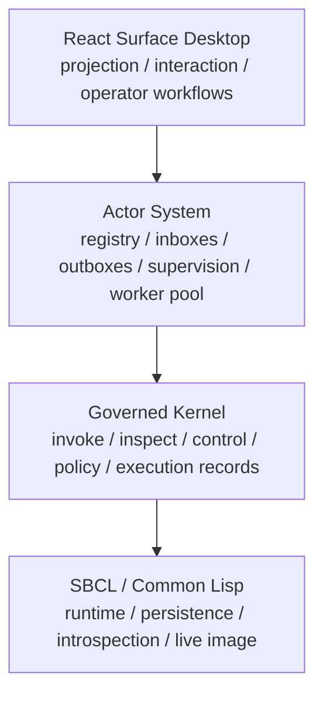
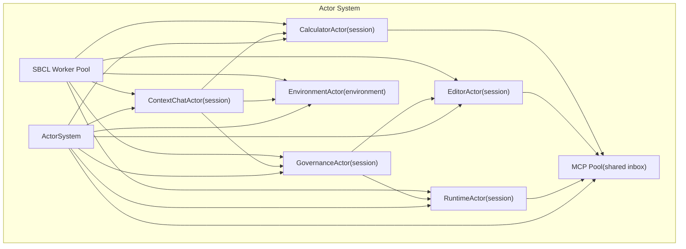
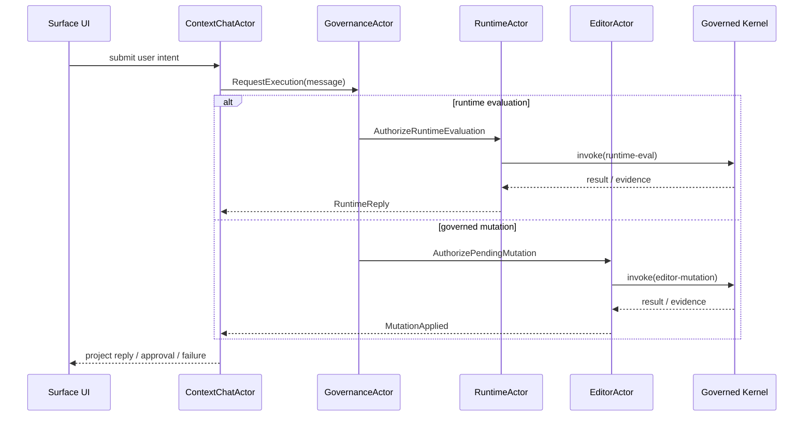
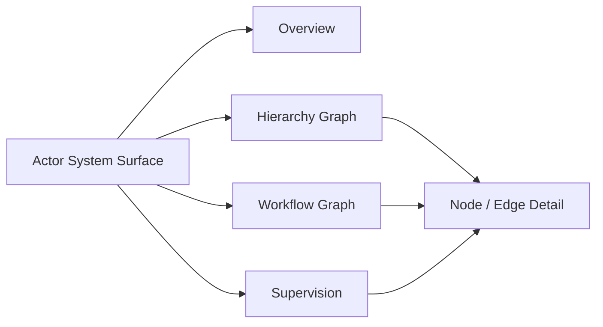

<strong>Current status:</strong> sbcl-agent now runs as a layered environment: SBCL/Common Lisp as the runtime and persistence substrate, a more traditional governed kernel as the authority boundary, an address-based actor system as the primary execution and workflow substrate, and the React Surface desktop as the projection layer. The integrated agent runs inside the same environment it is inspecting and changing, policy-based governance is native to the stack, and provider-bound planning now flows through a canonical planning-context packet with explicit authority, capability, project, evidence, and uncertainty sections.

## Start Here

If you are new to the project, do not start with the roadmap.

Use this order instead:

1. [The Problem](https://pauljbernard.github.io/sbcl-agent/problem.html)
2. [Foundation](https://pauljbernard.github.io/sbcl-agent/foundation.html)
3. [Getting Started](https://pauljbernard.github.io/sbcl-agent/getting-started.html)
4. [User Guide](https://pauljbernard.github.io/sbcl-agent/user-guide.html)
5. [Architecture](https://pauljbernard.github.io/sbcl-agent/architecture.html)

## Current Surface Desktop

The current `Surface` desktop host for `sbcl-agent` looks like this:

## Current Layered Architecture

The current stack is no longer just “shell over kernel.” It is now a shared introspective environment with a distinct actor-system layer between the governed kernel and the React presentation tier.

## Actor System Architecture

The actor system is now the primary message-driven capability and workflow substrate above the kernel.

## Planning Context Engineering

The integrated agent now plans and executes against a canonical planning packet rather than a transcript-only prompt:

That packet carries:

- stable system identity through `agent-constitution`
- live capability and dependency posture through `capability-inventory`
- project and workflow frame of reference
- decisive evidence instead of broad relevance alone
- structured uncertainty, contradictions, and inspection obligations
- archetype- and risk-aware strategy defaults

## Runtime And Governance Flow

## Actor System Surface

The live `Actor System` surface in `Surface` now projects the actor registry, hierarchy, workflow edges, supervision incidents, and worker-pool state directly from actor-system data rather than inferring architecture from transcript behavior.

If you are evaluating whether the system is safe or mature enough for your use, read [Safety and Risk](https://pauljbernard.github.io/sbcl-agent/safety-and-risk.html) immediately after the user guide.

  <a class="quick-link" href="https://pauljbernard.github.io/sbcl-agent/problem.html"><strong>The Problem</strong>Understand why the old model worked, why it now constrains understanding, and why this project exists.</a>
  <a class="quick-link" href="https://pauljbernard.github.io/sbcl-agent/getting-started.html"><strong>Getting Started</strong>Run the shell, create a thread, and execute a first turn.</a>
  <a class="quick-link" href="https://pauljbernard.github.io/sbcl-agent/user-guide.html"><strong>User Guide</strong>Use the actual operator surface: CLI commands, shell commands, conversation flow, approvals, and incident inspection.</a>
  <a class="quick-link" href="https://pauljbernard.github.io/sbcl-agent/application-domains.html"><strong>Application Domains</strong>See where governed, runtime-aware causality becomes necessary rather than optional.</a>
  <a class="quick-link" href="https://pauljbernard.github.io/sbcl-agent/foundation.html"><strong>Foundation</strong>Learn the three-truth model and the environment-first framing.</a>
  <a class="quick-link" href="https://pauljbernard.github.io/sbcl-agent/architecture.html"><strong>Architecture</strong>Map the conceptual model onto the code that exists today.</a>
  <a class="quick-link" href="https://pauljbernard.github.io/sbcl-agent/context-engineering.html"><strong>Context Engineering</strong>See how retrieval, authority, capability inventory, project targeting, and uncertainty now shape the planning packet.</a>
  <a class="quick-link" href="https://pauljbernard.github.io/sbcl-agent/robust-actor-kernel-architecture.html"><strong>Actor Runtime</strong>See the actor-system layer, worker-pool execution model, and kernel authority boundary.</a>
  <a class="quick-link" href="https://pauljbernard.github.io/sbcl-agent/actor-system-panel.html"><strong>Actor System Surface</strong>See how the live hierarchy, workflow graph, supervision, and runtime pool are projected to operators.</a>
  <a class="quick-link" href="https://pauljbernard.github.io/sbcl-agent/safety-and-risk.html"><strong>Safety and Risk</strong>Read the system's strengths, weaknesses, and governance model directly.</a>

## Recommended Reading Order

If you are new to the project, read in this order:

1. [The Problem](https://pauljbernard.github.io/sbcl-agent/problem.html)
2. [Application Domains](https://pauljbernard.github.io/sbcl-agent/application-domains.html)
3. [Foundation](https://pauljbernard.github.io/sbcl-agent/foundation.html)
4. [Core Entities](https://pauljbernard.github.io/sbcl-agent/core-entities.html)
5. [Mutation Model](https://pauljbernard.github.io/sbcl-agent/mutation-model.html)
6. [Architecture and Design](https://pauljbernard.github.io/sbcl-agent/architecture.html)
7. [Getting Started](https://pauljbernard.github.io/sbcl-agent/getting-started.html)
8. [User Guide](https://pauljbernard.github.io/sbcl-agent/user-guide.html)
9. [Safety and Risk](https://pauljbernard.github.io/sbcl-agent/safety-and-risk.html)

Then use the roadmap and transition documents as enhancement and evolution context rather than as explanations of still-missing core architecture.

## Use It Now

If your goal is not architectural orientation but immediate use, go directly to:

- [Getting Started](https://pauljbernard.github.io/sbcl-agent/getting-started.html)
- [User Guide](https://pauljbernard.github.io/sbcl-agent/user-guide.html)
- [Conversation Runtime](https://pauljbernard.github.io/sbcl-agent/conversation-architecture.html)
- [Streaming Event Model](https://pauljbernard.github.io/sbcl-agent/streaming-event-model.html)
- [Safety and Risk](https://pauljbernard.github.io/sbcl-agent/safety-and-risk.html)

## Historical Baseline And Current Target

The historical transition is easiest to understand if you look at the older baseline diagram next to the accepted target architecture that now describes the implemented system:

  <a class="card" href="https://pauljbernard.github.io/sbcl-agent/agentos-current-state-gap-analysis.html">
    
Historical Baseline Architecture

    
The earlier pre-closure baseline used to explain what `sbcl-agent` and `sbcl-agent-ux` looked like before the target architecture was substantially implemented.

    
  </a>

  <a class="card" href="https://pauljbernard.github.io/sbcl-agent/agentos-target-state-architecture.html">
    
IntentOS Target Architecture

    
The execution-kernel architecture that now serves as the authoritative description of the implemented system: `invoke`, `inspect`, `control`, execution handles, compatibility, UX, and platform layers.

    
  </a>

## Deeper Reference And Archive

The remainder of this front door is reference-heavy material:

- historical transition context
- architecture and subsystem references
- roadmap and implementation plans
- validation and journey analysis
- Common Lisp runtime/reference material

That material is useful, but it should normally come after you understand the basic operating model and the current user surface.

## Documentation Layers

  <a class="card" href="https://pauljbernard.github.io/sbcl-agent/problem.html">
    
The Problem

    
The rationale for the project in terms of changing constraints, runtime understanding, and the limits of current SDLC and agent models.

  </a>
  <a class="card" href="https://pauljbernard.github.io/sbcl-agent/application-domains.html">
    
Application Domains

    
Why governed environments such as finance, intelligence, and regulated enterprise work expose the need for intrinsic causality and evidence.

  </a>
  <a class="card" href="https://pauljbernard.github.io/sbcl-agent/foundation.html">
    
Foundation

    
What sbcl-agent is, what it is not, and how source truth, image truth, and workflow truth fit together.

  </a>
  <a class="card" href="https://pauljbernard.github.io/sbcl-agent/core-entities.html">
    
Core Entities

    
The environment, runtime, thread, turn, operation, artifact, work-item, workflow record, agent, policy, and incident model.

  </a>
  <a class="card" href="https://pauljbernard.github.io/sbcl-agent/mutation-model.html">
    
Mutation Model

    
The lifecycle for governed change: inspect, plan, checkpoint, mutate, observe, validate, reconcile, and close or quarantine.

  </a>
  <a class="card" href="https://pauljbernard.github.io/sbcl-agent/why-sbcl-agent.html">
    
Why sbcl-agent Exists

    
An additional positioning and differentiation document that captures the project's broader thesis and the legacy-tooling trap it is avoiding.

  </a>
  <a class="card" href="https://pauljbernard.github.io/sbcl-agent/objectives.html">
    
Objectives

    
The product, architecture, and operational goals that define success for the current implementation and the next stage.

  </a>
  <a class="card" href="https://pauljbernard.github.io/sbcl-agent/architecture.html">
    
Architecture and Design

    
The current code structure, ownership boundaries, environment transition, and how the implemented runtime maps onto the conceptual model.

  </a>
  <a class="card" href="https://pauljbernard.github.io/sbcl-agent/getting-started.html">
    
Getting Started

    
The shortest path to running the system and completing a first thread-based interaction.

  </a>
  <a class="card" href="https://pauljbernard.github.io/sbcl-agent/user-guide.html">
    
User Guide

    
The detailed operator reference for the CLI, Lisp shell, conversation flow, approvals, incidents, and environment inspection.

  </a>
  <a class="card" href="https://pauljbernard.github.io/sbcl-agent/safety-and-risk.html">
    
Safety and Risk

    
The system's explicit risk categories, safety principles, governance model, and honest current limitations.

  </a>
  <a class="card" href="https://pauljbernard.github.io/sbcl-agent/implementation-plan.html">
    
Implementation Plan

    
The delivery roadmap for moving from the current implementation toward the fuller environment-centered architecture.

  </a>
  <a class="card" href="https://pauljbernard.github.io/sbcl-agent/user-journey-gap-matrix.html">
    
User Journey Gap Matrix

    
A formal analysis of operator journeys against the project’s stated objectives, current implementation, and architectural gaps.

  </a>
  <a class="card" href="https://pauljbernard.github.io/sbcl-agent/user-journey-implementation-backlog.html">
    
User Journey Backlog

    
A prioritized backlog of epics, file targets, acceptance criteria, and iteration order derived from the journey analysis.

  </a>
  <a class="card" href="https://pauljbernard.github.io/sbcl-agent/testing-coverage-analysis.html">
    
Testing Coverage Analysis

    
A measured assessment of unit coverage, functional coverage, user-story coverage, and current performance-testing gaps.

  </a>
  <a class="card" href="https://pauljbernard.github.io/sbcl-agent/roadmap/engineering-parity-plan.html">
    
Engineering Parity Plan

    
The concrete program for pushing sbcl-agent toward parity or advantage against leading software engineering agents through internal evaluation, memory, orchestration, UX hardening, and reflective improvement.

  </a>
  <a class="card" href="https://pauljbernard.github.io/sbcl-agent/conversation-architecture.html">
    
Conversation Runtime

    
The thread, message, turn, operation, and artifact model, now treated as one subsystem within the larger Environment architecture.

  </a>
  <a class="card" href="https://pauljbernard.github.io/sbcl-agent/roadmap/vision.html">
    
Vision

    
The forward-looking positioning statement for the environment-first direction. Useful after the problem and foundation docs.

  </a>
  <a class="card" href="https://pauljbernard.github.io/sbcl-agent/roadmap/environment-model.html">
    
Environment Model

    
The deeper roadmap document for the environment model and its long-term structural implications.

  </a>
  <a class="card" href="https://pauljbernard.github.io/sbcl-agent/capability-translation-matrix.html">
    
Capability Translation Matrix

    
A design filter that maps legacy Lisp tool powers into agentic environment primitives so the project preserves capabilities without rebuilding a legacy IDE.

  </a>
  <a class="card" href="https://pauljbernard.github.io/sbcl-agent/roadmap/codex-execution-plan.html">
    
Codex Execution Plan

    
A detailed, repository-specific implementation plan with phases, files, tests, and acceptance criteria for building the vision on top of the current codebase.

  </a>
  <a class="card" href="https://pauljbernard.github.io/sbcl-agent/streaming-event-model.html">
    
Streaming Event Model

    
The event-native streaming contract that separates visible assistant text from runtime execution and workflow evidence.

  </a>
  <a class="card" href="https://pauljbernard.github.io/sbcl-agent/kernel-invariants.html">
    
Kernel Invariants

    
The execution-kernel doctrine, three-function API, execution-handle model, and non-bypassable governance rules for IntentOS-oriented refactoring.

  </a>
  <a class="card" href="https://pauljbernard.github.io/sbcl-agent/intentos-constitution.html">
    
IntentOS Constitution

    
The governing product and architecture rules for evolving the current runtime and UX into a minimal, governed execution-kernel operating system.

  </a>
  <a class="card" href="https://pauljbernard.github.io/sbcl-agent/intentos-requirements.html">
    
IntentOS Requirements

    
The consolidated kernel, governance, UX, compatibility, and platform requirements for the transition to IntentOS.

  </a>
  <a class="card" href="https://pauljbernard.github.io/sbcl-agent/intentos-feature-specifications.html">
    
IntentOS Feature Specs

    
The required specification discipline for new features so they reinforce the kernel model, governance model, and shell model.

  </a>
  <a class="card" href="https://pauljbernard.github.io/sbcl-agent/ux-design-system.html">
    
UX Design System

    
The structural UX model for evolving sbcl-agent-ux from an application interface into a shell over governed executions.

  </a>
  <a class="card" href="https://pauljbernard.github.io/sbcl-agent/desktop-windowing-implementation-plan.html">
    
Desktop Windowing Plan

    
The concrete implementation plan for moving from shell framing into a real multitasking desktop with governed windows and concurrent live surfaces.

  </a>
  <a class="card" href="https://pauljbernard.github.io/sbcl-agent/ux-style-guide.html">
    
UX Style Guide

    
The visual and interaction style rules that should reinforce inspectability, governance, and execution-centered interaction.

  </a>
  <a class="card" href="https://pauljbernard.github.io/sbcl-agent/operator-journeys.html">
    
Operator Journeys

    
The canonical operator journeys that should drive refactoring order, shell behavior, and execution-surface design.

  </a>
  <a class="card" href="https://pauljbernard.github.io/sbcl-agent/validation-strategy.html">
    
Validation Strategy

    
The architecture-level validation plan for proving kernel invariants, execution handles, shell coherence, and compatibility containment.

  </a>
  <a class="card" href="https://pauljbernard.github.io/sbcl-agent/agentos-current-state-gap-analysis.html">
    
Historical Baseline Assessment

    
The older baseline diagram and the accompanying explanation of how that baseline maps to the enhancement and hardening questions that remain after target-architecture closure.

  </a>
  <a class="card" href="https://pauljbernard.github.io/sbcl-agent/agentos-target-state-architecture.html">
    
IntentOS Target Architecture

    
The compressed target model: a governed execution kernel built around invoke, inspect, control, execution handles, compatibility, UX, and platform layers.

  </a>
  <a class="card" href="https://pauljbernard.github.io/sbcl-agent/agentos-implementation-plan.html">
    
IntentOS Implementation Plan

    
The completed architecture program and the remaining enhancement tracks beyond initial target-state attainment.

  </a>
  <a class="card" href="https://pauljbernard.github.io/sbcl-agent/rgp-sbcl-agent-event-contract.html">
    
RGP-sbcl-agent Event Contract

    
The federated event envelope and event-family contract between global orchestration in RGP and local execution truth in sbcl-agent.

  </a>
  <a class="card" href="https://pauljbernard.github.io/sbcl-agent/evidence-profiles-and-visibility-rules.html">
    
Evidence Profiles and Visibility Rules

    
The node-side publication, disclosure, and evidence posture rules for employee-operated and contractor-operated execution.

  </a>
  <a class="card" href="https://pauljbernard.github.io/sbcl-agent/migration-plan-thread-runtime.html">
    
Migration Plan

    
The compatibility-preserving path from flat session-plus-ask behavior to thread-based conversation orchestration.

  </a>
  <a class="card" href="https://pauljbernard.github.io/sbcl-agent/common-lisp-runtime.html">
    
Common Lisp as a Runtime

    
Why SBCL and Common Lisp are useful here, and what engineering discipline is required to use that power safely.

  </a>
  <a class="card" href="https://pauljbernard.github.io/sbcl-agent/common-lisp-guide.html">
    
Common Lisp Reference

    
A multi-page language-reference section covering syntax, bindings, control flow, collections, objects, packages, I/O, and runtime behavior.

  </a>

## What the System Supports Now

`sbcl-agent` currently combines:

- an SBCL-native CLI and Common Lisp shell
- direct Lisp evaluation in the live runtime
- multi-vendor providers spanning mock, OpenAI-compatible, Anthropic, Google/Gemini-compatible, Meta-compatible, and LM Studio/local-compatible backends
- provider profiles, routing policies, prompt-aware route preview, and service-backed provider selection
- canonical provider event normalization for streaming
- a concrete Environment object with save/load and projected environment events
- retrieval dossiers, reasoning/planning briefs, validation strategies, and prior-outcome reuse in the default turn path
- persistent threads, messages, turns, operations, and artifacts
- runtime inspection, eval, reload, and history commands with policy gates
- first-class incident recording, operator summaries, and environment event inspection
- direct Lisp control, conversation, and governed workflow as coexisting interaction modes
- approval-gated actions, turn resume, session persistence, tasks, and workers
- work-items, workflow records, validator replay groups, and image-to-source reconciliation paths
- stable public service interfaces and non-shell JSON CLI surfaces for shell, desktop, and external clients
- kernel-facing `invoke`, `inspect`, and `control` seams with execution handles becoming first-class operator references
- execution surfaces, workspace, governance queue, object browser, and inspector shell models
- a hostable desktop contract for `sbcl-agent-ux` through `desktop/show`, `desktop/action`, and `desktop/restore`
- compatibility execution tracking and lifecycle posture for Linux app and tool-backed governed executions
- developer-platform manifests and `.aop` package lifecycle flows including export, validation, import, activation, install, and applied-profile inspection

## Strengths

The current implementation is strongest where the code and the documentation now agree:

- it is genuinely SBCL-native rather than a wrapper hiding critical logic elsewhere
- it gives operators direct access to the runtime they are reasoning about
- it preserves explicit governance concepts such as approvals, incidents, work-items, and workflow records
- it already supports durable conversational turns instead of one-shot prompt/response behavior
- it now has a real execution-kernel seam rather than only service-local mutation rules
- it now has a thin-host desktop model that `sbcl-agent-ux` consumes directly through the shell desktop contract

## Weaknesses

The current implementation is also honestly transitional:

- some compatibility-session structure still exists alongside the stronger environment model
- the environment-native agent model is still shallower than the runtime, workflow, and compatibility layers
- alternative runtime backends, richer artifact coverage, and broader external SDK/distribution depth remain enhancement work
- some older documents remain deeper and more roadmap-heavy than a new reader should start with
- some documentation and docs-build infrastructure still needs cleanup to match the current repository state

## Current Architectural Rule

The codebase is still organized around one ownership rule:

- conversation owns interaction state
- runtime owns execution state
- workflow owns engineering governance

That rule keeps the system from collapsing chat history, live runtime state, and engineering evidence into one undifferentiated session blob. The new roadmap extends this by placing those domains inside a larger Environment object rather than treating thread or shell state as the architectural center.

The newer compression rule now sits alongside it:

- execution is being normalized under `invoke`
- execution-backed reads are being normalized under `inspect`
- intervention is being normalized under `control`

## Why the Reading Order Matters

Readers should not have to infer the story from roadmap material.

The intended journey is:

1. understand the problem
2. understand where the problem matters most
3. understand the model
4. understand the implemented architecture
5. learn how to operate the system
6. understand the risks and the forward plan
