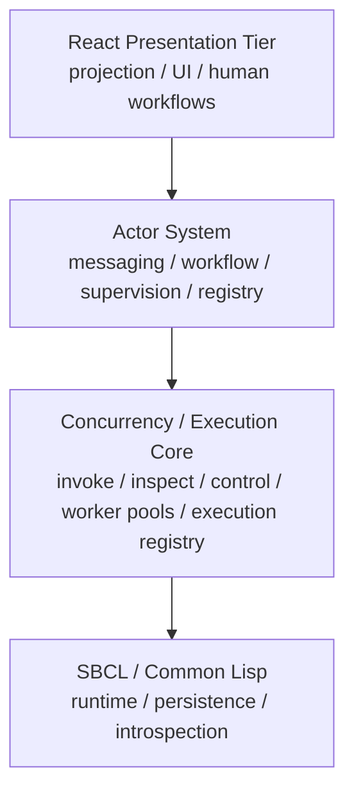
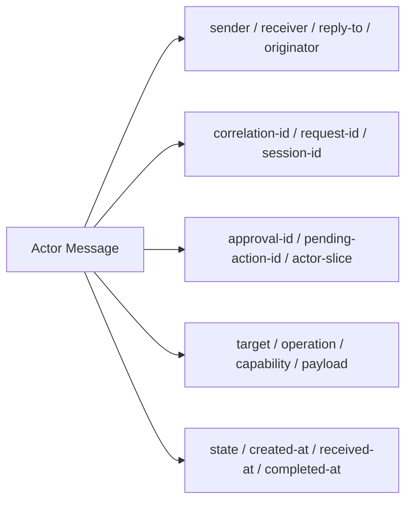
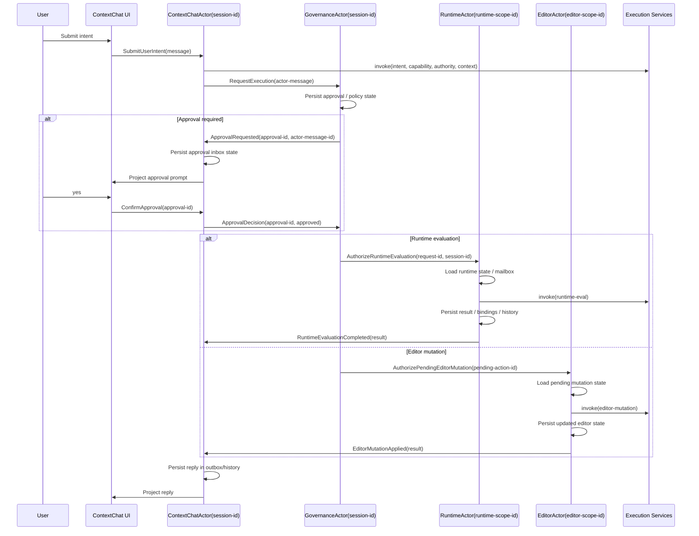

# Actor Runtime, Concurrency, And Governance

This document is now the deep architectural reference for five tightly related concerns:

- the actor model
- the concurrency model
- the governance model
- the self-hosted introspective runtime
- the way context integration flows through those layers

The older “governed kernel above the runtime” framing is now historically useful but no longer the best description of the implemented system. The architecture has been simplified:

- the shared execution and concurrency substrate owns worker pools, queues, futures, execution handles, and registry mechanics
- the actor runtime owns message-driven workflow continuity
- governance is enforced in actor execution and effect handling
- the integrated agent inhabits the same environment it is inspecting and changing

## Visual Architecture

```mermaid
flowchart TB
    User["User"] --> ChatUI["Context Chat UI"]
    User --> EditorUI["Editor Surface UI"]
    User --> CalcUI["Calculator UI"]
    User --> RuntimeUI["Runtime / REPL UI"]

    subgraph UX["UX Projection Layer"]
        ChatUI
        EditorUI
        CalcUI
        RuntimeUI
    end

    subgraph Core["Concurrency / Execution Core"]
        Invoke["Execution Services<br/>invoke / inspect / control"]
        Trace["Execution Trace / Event Log"]
        Ledger["Execution Ledger / Task Records"]
        Registry["Execution Registry / Manifests"]
        Pools["Bounded Worker Pools"]
        Futures["Ask / Future Registry"]
    end

    subgraph ActorRuntime["Actor Runtime"]
        Router["Actor Router / Address Directory"]
        Mailboxes["Persistent Mailboxes"]
        DLQ["Dead Letter Queue"]
        Supervisor["Supervision / Retry / Restart Policy"]
        Policy["Governance / Approval / Effect Gate"]

        ContextChat["ContextChatActor(session-id)"]
        Governance["GovernanceActor(session-id)"]
        RuntimeActor["RuntimeActor(runtime-scope-id)"]
        EditorActor["EditorActor(editor-scope-id)"]
        CalculatorActor["CalculatorActor(calc-scope-id)"]
        MCPActor["MCPBridgeActor(server-id)"]
        EnvironmentActor["EnvironmentActor(environment-id)"]
    end

    subgraph State["Persistent Actor State"]
        ChatState["Chat Session State"]
        GovernanceState["Approval / Policy State"]
        RuntimeState["Runtime Eval History / Bindings"]
        EditorState["Pending Mutations / Buffer State"]
        CalcState["Calculator Session State"]
    end

    ChatUI --> ContextChat
    EditorUI --> EditorActor
    CalcUI --> CalculatorActor
    RuntimeUI --> RuntimeActor

    ContextChat <--> Router
    Governance <--> Router
    RuntimeActor <--> Router
    EditorActor <--> Router
    CalculatorActor <--> Router
    MCPActor <--> Router
    EnvironmentActor <--> Router

    Router --> Mailboxes
    Mailboxes --> DLQ
    Supervisor --> Mailboxes
    Supervisor --> DLQ

    ContextChat <--> ChatState
    Governance <--> GovernanceState
    RuntimeActor <--> RuntimeState
    EditorActor <--> EditorState
    CalculatorActor <--> CalcState

    ContextChat --> Invoke
    Governance --> Policy
    RuntimeActor --> Invoke
    EditorActor --> Invoke
    CalculatorActor --> Invoke
    MCPActor --> Registry
    EnvironmentActor --> Ledger
    Router --> Pools
    Mailboxes --> Futures

    Invoke --> Ledger
    Invoke --> Trace
    Policy --> Ledger
    Policy --> Trace
    Mailboxes --> Trace
    Mailboxes --> Ledger

    Trace --> UX
    Ledger --> UX
```

## Current Implemented Status

The target model above is no longer only aspirational. The current code now includes these implemented slices:

- actor registry definitions for core singleton actors and pooled manifest-backed actors
- canonical session-scoped actor identity for core singletons such as:
  - `ContextChatActor(session-id)`
  - `GovernanceActor(session-id)`
  - `RuntimeActor(session-id)`
  - `EditorActor(session-id)`
  - `CalculatorActor(session-id)`
- runtime inbox, outbox, and actor-owned runtime continuity state
- actor-system panel queries that project:
  - hierarchy
  - workflow edges
  - supervision incidents
  - worker-pool execution metrics
- planner-context and provider-request surfaces that project:
  - `agent-constitution`
  - `capability-inventory`
  - explicit Context Chat project targeting
  - contradiction-aware uncertainty
- a real SBCL worker-pool runner for thread-pool-backed actor execution
- a dedicated shared concurrency core for:
  - worker lifecycle
  - futures
  - queue primitives
  - keyed serialization
  - lease/wait coordination
- actor-governed mutation paths across runtime, workspace/editor, environment, package-management, project, workflow, and platform control families

The system is therefore in the middle phase:

- no longer a purely metadata-shaped actor model
- no longer a kernel-centric control plane
- still being hardened and documented around remaining edge cases and UX recovery behavior

## Layered Stack

The target architecture is intentionally layered:

1. `SBCL / Common Lisp`
   - primary implementation runtime
   - primary in-process state model
   - primary persistence/materialization layer
   - full introspection of runtime objects, packages, symbols, methods, and persisted state

2. `Concurrency / Execution Core`
   - bounded worker pools
   - shared queues, futures, and execution-handle lifecycle
   - execution recording, inspect/control services, and capability registry
   - keyed serialization where mutation or effect classes require it

3. `Actor System`
   - primary messaging and workflow substrate
   - address registry
   - mailbox execution
   - supervision hierarchy
   - singleton/pool allocation policy
   - governance-aware turn and effect routing
   - introspectable actor hierarchy, message graph, mailbox pressure, and failure state

4. `React Presentation Tier`
   - projection of actor/kernel/runtime state
   - human-facing workflow surfaces
   - never the owner of routing or continuity
   - should remain fully reconstructible from lower-layer state

### Layering Rules

1. The presentation tier projects state; it does not own workflow continuity.
2. The actor system owns message-driven business workflow.
3. Governance is enforced in actor execution and effect handling, not in a monolithic shell-facing kernel layer.
4. The execution core owns scheduling, handles, queues, and concurrency primitives.
5. SBCL/Common Lisp remains the foundational runtime and persistence substrate.
5. Every layer must be introspectable so agents and humans can inspect the same system from different vantage points.

## Shared Environment Principle

The integrated agent does not stand outside the environment.

It:

- draws context from the same SBCL environment
- reasons over the same runtime and persisted state
- performs work inside that same environment
- and is constrained by the same governance and effect boundaries as any other actor-driven execution

## Concurrency Model

The system does not use one thread per actor. It uses many actors mapped onto bounded SBCL worker pools.

The primary execution unit is the actor turn:

1. dequeue eligible work
2. bind actor and environment context
3. execute handler logic
4. emit candidate effects
5. govern and commit or reject those effects
6. record the resulting execution and events
7. yield back to the pool

Important properties of the current model:

- reads may overlap when policy allows them
- governed writes serialize by keyed domains rather than one global choke point
- same-actor execution respects actor max-concurrency settings
- queue leasing, future completion, gates, and worker lifecycle come from the shared concurrency core
- the execution substrate is shared by both actor runtime paths and public execution services

## Governance Model

Governance is now part of the actor runtime, not a separate post-hoc audit layer.

The practical governance loop is:

1. a request enters through an execution service
2. an actor claims or routes the work
3. policy is resolved for the requested operation
4. approval requirements are computed
5. effects are allowed, blocked, or paused
6. the resulting execution is recorded with evidence, approval state, and authority metadata

This model matters because it makes governance operate at the same boundary as the work itself:

- runtime mutation
- workspace mutation
- environment mutation
- project/workflow mutation
- package and platform mutation
- approval/resume/recovery flows

The system therefore preserves:

- who requested the change
- what authority existed
- whether approval was required
- whether approval was granted
- what evidence or incident state resulted

without routing everything through a monolithic kernel switchboard.

## Actor Message Spine

## Canonical Flow

## Design Rules

1. Actors do not bypass policy, execution recording, or effect mediation.
   - They send requests through kernel-governed execution surfaces.

2. Actors own routing and continuity.
   - Threads, turns, and transcript panels are presentation artifacts only.
   - Continuity must be carried by actor message fields and actor-owned state.

3. Planning context must be authoritative, not merely convenient.
   - The integrated agent should prefer `authority-state` and decisive evidence over transcript-shaped support material.
   - Project targeting, capability readiness, and uncertainty are now architectural inputs to execution rather than presentation-only metadata.

3. Mailboxes are primary.
   - Task records and transcript state are not the routing backbone.
   - Mailbox entries are the canonical lifecycle objects.

4. Actor state is encapsulated.
   - `ContextChatActor` owns chat session continuity.
   - `GovernanceActor` owns approval and authorization continuity.
   - `RuntimeActor` owns multi-turn eval continuity and runtime result history.
   - `EditorActor` owns pending mutation and apply continuity.

5. Replies are actor messages.
   - Capability completion should return through actor outboxes and inboxes, not ad hoc direct return paths.

6. Failure handling is actor-native.
   - retries
   - restart strategy
   - dead-letter routing
   - explicit failure replies

## Required Actor-System Semantics

1. Frontend/backend interaction is asynchronous by default.
   - Treat cross-boundary communication as `tell`, not `ask`, unless an explicit exception is documented.
   - UI surfaces project actor replies; they do not synchronously drive capability execution.

2. Each actor is a standalone serial processor.
   - one inbox
   - one message processed at a time
   - message fully handled before the next message is consumed
   - all downstream work issued by actor address, never by direct pointer/reference

3. Actor addressing is actor-system owned.
   - the actor system is the root actor
   - it owns the actor registry and address directory
   - actor lookup, singleton resolution, and pool routing are actor-system responsibilities

4. Allocation strategy is first-class.
   - actors may be `singleton`
   - actors may be `pool`
   - pooled actors share an inbox contract plus a consumption strategy
   - pool policy must be explicit, for example:
     - `:round-robin`
     - `:competing-consumers`
     - `:affinity-by-session`
     - `:affinity-by-scope`
   - thread usage should prefer pooled worker execution rather than one OS thread per actor instance
   - mailbox seriality still applies even when actors execute on a shared thread pool

### Current Threading Posture

The desired concurrency model is now explicit and partly implemented:

- actors do not permanently own threads
- logical singleton actors still execute serially per actor identity
- pooled SBCL workers lease a message while it is executing
- that worker returns to the pool when no mailbox work is being processed for that job

The remaining work is extending this runner uniformly across all capability paths, not just governed desktop-task execution.

5. Actors fail fast and escalate upward.
   - a failed actor must not be trusted to recover itself
   - it sends failure state and diagnostic context to its parent
   - the parent decides:
     - restart
     - replace
     - quarantine
     - dead-letter
     - escalate further

6. Workflow logic is the inter-actor sequence.
   - business behavior emerges from message flow across specialized actors
   - sequence diagrams are therefore part of the executable architecture, not only documentation
   - each actor should stay small:
     - mutate its own state
     - call the kernel
     - call the prescribed LLM
     - send messages to other actors

## Current Gap From This Target

The current implementation is closest to this target in:

- message envelope shape
- actor-flow read models
- mailbox persistence
- governance/editor routing

It is still weakest in:

- actor-local behavior loops
- primary mailbox-driven execution
- runtime actor autonomy
- supervision semantics
- reply/outbox-first result handling

## Immediate Next Step

The next implementation cut should be:

1. make `RuntimeActor` a first-class actor peer to `EditorActor`
2. make chat-triggered runtime eval produce primary runtime mailbox messages
3. make runtime results return through a runtime outbox / reply channel
4. keep the kernel as the execution and governance authority under that actor flow

## Maturity Benchmark

Use Akka as the reference maturity model for actor-system semantics, while preserving SBCL/kernel-specific implementation choices.

For implementation details and concrete open-source reference behavior, use Apache Pekko as the practical companion reference:

- [Pekko documentation](https://pekko.apache.org)
- [Pekko source](https://github.com/apache/pekko)

Akka is the comparison point for:

1. address-based actor messaging
2. serial mailbox processing
3. explicit supervision trees
4. singleton vs pooled/router allocation
5. failure escalation to parent actors
6. mailbox-first execution rather than central orchestration
7. observable message flow and actor lifecycle

The goal is not JVM parity. The goal is semantic parity in the parts that define a robust actor system.

### Current Maturity Against That Benchmark

1. Message envelope maturity: high
   - sender / receiver / reply-to / originator / correlation ids are strong

2. Registry and addressing maturity: medium-high
   - actor-system root exists
   - actor definitions now carry parent, allocation, supervision, and execution policy

3. Mailbox read-model maturity: medium-high
   - inbox/outbox/state views exist
   - actor-flow visibility exists
   - explicit mailbox transitions exist in some flows

4. Mailbox-first execution maturity: low-medium
   - too much execution still derives from task-record orchestration
   - dequeue / handle / reply / ack / fail is not yet the universal execution model

5. Supervision maturity: medium
   - supervision metadata exists
   - failure policy is modeled
   - parent-owned executable recovery semantics are still incomplete

6. Pool/runtime execution maturity: medium
   - allocation strategy and pooled worker execution are modeled
   - shared-inbox pool behavior is described
   - live pool execution semantics are not yet broadly exercised

7. Runtime actor maturity: low-medium
   - inbox/outbox/runtime-state now exist
   - live cross-turn continuity still exposes hybrid behavior

8. UX observability maturity: medium
   - actor-flow is visible
   - the actor-system panel is now specified
   - the full live panel is not yet implemented

### Maturity Gate For “Robust Actor System”

Do not call the system robust until all of the following are true:

1. Every actor consumes from an inbox as the primary execution contract.
2. Every failure becomes a supervision event owned by the parent actor.
3. Every actor reply is emitted through outbox/reply state, not ad hoc return paths.
4. Pool semantics are executable, not only declared in metadata.
5. The actor-system panel renders the live hierarchy and workflow graph from running actor state.
